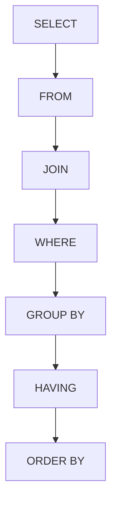

# Normes de codage SQL : Indentation et organisation logique des requêtes  

Une écriture claire et bien structurée des requêtes SQL est indispensable pour assurer la lisibilité, la maintenabilité, et faciliter la collaboration entre développeurs ou analystes. Cette partie traite des bonnes pratiques d’indentation et d’organisation logique des requêtes SQL, basées sur des standards récents (2024) et issues de sources fiables.

---

## 1. Pourquoi soigner l’indentation et l’organisation logique ?

Le code SQL peut rapidement devenir complexe, notamment avec des requêtes imbriquées, des jointures multiples, ou des conditions détaillées. Sans indentation cohérente ni structure visible, le code devient difficile à déchiffrer, source d’erreurs et coûteux à maintenir ou modifier.

- **Indentation :** Permet de visualiser facilement les blocs et niveaux d’imbrication (SELECT imbriqués, sous-requêtes, clauses WHERE multi-conditions...).
- **Organisation logique :** Facilite la compréhension du flux de la requête en regroupant visuellement les sections fonctionnelles (projection, filtration, agrégation…).

---

## 2. Principes clés pour une indentation efficace en SQL

### a) Respecter la hiérarchie et le niveau d’imbrication

Chaque niveau dans la requête doit correspondre à un niveau d’indentation clairement délimité par des espaces (recommandation : 4 espaces par niveau, éviter les tabulations qui peuvent varier selon les éditeurs).

```sql
SELECT customer_id, 
       COUNT(order_id) AS total_orders
FROM orders
WHERE order_date >= '2023-01-01'
GROUP BY customer_id
ORDER BY total_orders DESC;
```

Si la requête contient une sous-requête, elle s’indente davantage :

```sql
SELECT customer_id,
       (SELECT COUNT(*)
        FROM orders o
        WHERE o.customer_id = c.customer_id) AS order_count
FROM customers c;
```

### b) Aligner clairement les clauses principales et secondaires

Les mots-clés SQL (`SELECT`, `FROM`, `WHERE`, `GROUP BY`, `ORDER BY`, `JOIN`) doivent commencer toujours en début de ligne pour les distinguer facilement.

Exemple illustrant l’alignement et la lisibilité :

```sql
SELECT c.customer_name,
       o.order_id,
       o.order_date
FROM customers c
JOIN orders o
    ON c.customer_id = o.customer_id
WHERE o.order_date BETWEEN '2024-01-01' AND '2024-06-30'
ORDER BY o.order_date DESC;
```

### c) Indenter les conditions dans les clauses WHERE ou ON

Pour plusieurs conditions, chaque condition se place sur une nouvelle ligne avec indentations, ce qui facilite leur lecture et modification.

```sql
WHERE o.status = 'shipped'
  AND (o.order_date >= '2024-01-01'
       OR o.priority = 'high')
```

---

## 3. Organisation logique des sections dans une requête

Une requête se décompose généralement en sections distinctes. Respecter cet ordre rend la lecture intuitive :

1. **Sélection des colonnes (`SELECT`)**
2. **Source des données (`FROM`)**
3. **Joindre des tables (`JOIN`)**
4. **Filtrer les données (`WHERE`)**
5. **Regrouper (`GROUP BY`)**
6. **Filtrer les groupes (`HAVING`)**
7. **Ordonner les résultats (`ORDER BY`)**

---

## 4. Exemple complet avec commentaires

```sql
-- Sélection des clients avec leur nombre de commandes en 2024
SELECT c.customer_id,
       c.customer_name,
       COUNT(o.order_id) AS total_orders
FROM customers c
LEFT JOIN orders o
    ON c.customer_id = o.customer_id
    AND o.order_date >= '2024-01-01'
WHERE c.status = 'active'
GROUP BY c.customer_id,
         c.customer_name
HAVING COUNT(o.order_id) > 0
ORDER BY total_orders DESC;
```

---

## 5. Diagramme Mermaid pour visualiser une organisation typique de requête SQL  



---

## 6. Résumé des bonnes pratiques d’indentation et d’organisation logique SQL

| Pratique                     | Recommandation                      |
|------------------------------|-----------------------------------|
| Indentation                  | 4 espaces par niveau, pas de tab   |
| Keywords SQL                 | Always start clauses on new line   |
| Conditions                  | Each condition on separate line    |
| Sous-requêtes                | Indent avec +1 niveau               |
| Organisation des sections    | Respecter l’ordre logique          |
| Longueur de ligne            | Idéalement < 80-100 caractères      |

---

## Sources

- [365 Data Science - SQL Best Practices for Clean & Organized Code](https://365datascience.com/tutorials/sql-tutorials/sql-best-practices/)  
- [OWOX BI - BigQuery Code Standards & Best Practices](https://www.owox.com/blog/articles/bigquery-code-standards-best-practices)  
- [Stack Overflow - SQL Statement indentation good practice](https://stackoverflow.com/questions/272210/sql-statement-indentation-good-practice)  
- [LinkedIn - Best Practices Writing SQL Code](https://www.linkedin.com/pulse/best-practices-writing-sql-code-pomerolpartners-rcvec)  

---

Cette organisation claire et cette mise en forme soignée réduisent considérablement les erreurs, facilitent la relecture et rendent les modifications plus sûres et rapides à opérer. Appliquer ces normes d’indentation et organisation logique est un investissement gagnant pour tout projet SQL.