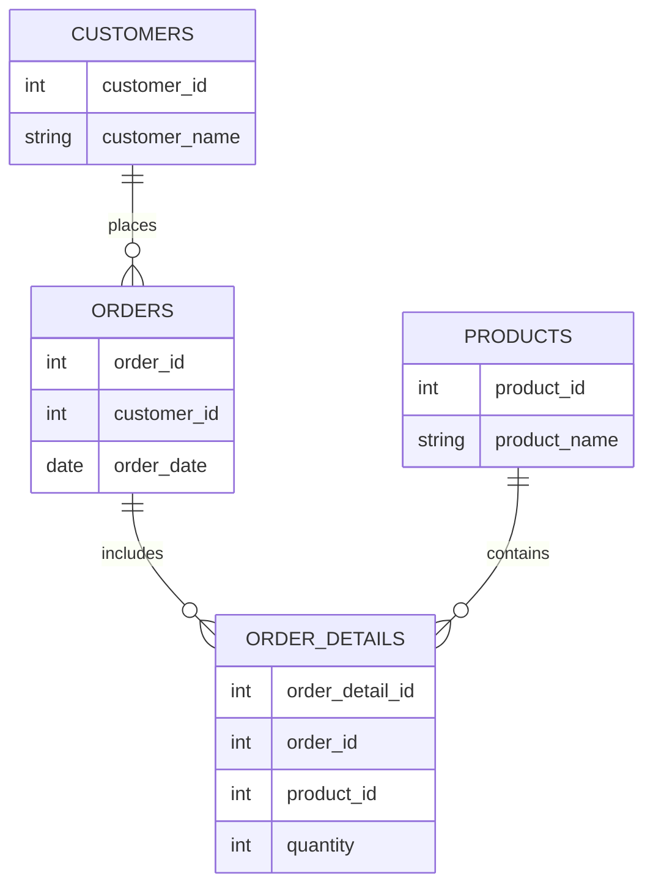

# Normes de codage SQL : Nomination explicite des alias et objets  

Une convention rigoureuse pour nommer les alias, tables, colonnes ou autres objets SQL améliore la clarté des requêtes, évite les ambiguïtés et facilite la maintenance. Cette article détaille les bonnes pratiques actuelles pour la nomination explicite dans les requêtes SQL.

---

## 1. Pourquoi nommer explicitement alias et objets ?

- **Clarté** : Des noms parlants permettent de comprendre la fonction ou la provenance d’un alias ou objet sans deviner.
- **Éviter les collisions** : Des alias explicites préviennent les conflits notamment dans les jointures multiples.
- **Maintenance facilitée** : Un SQL lisible et explicite est plus simple à modifier et à déboguer par soi-même ou par un tiers.
- **Conformité** : Respect de normes communes adoptées dans les équipes/projets.

---

## 2. Bonnes pratiques pour la nomination des alias

### a) Utiliser des alias explicites et significatifs

Privilégier des alias représentatifs du contenu ou table référencée.

```sql
-- Mauvaise pratique : alias trop courts ou vagues
SELECT c.name, o.date
FROM customers c
JOIN orders o ON c.id = o.customer_id;

-- Bonne pratique : alias explicites
SELECT cust.name, ord.order_date
FROM customers cust
JOIN orders ord ON cust.id = ord.customer_id;
```

### b) Eviter les alias trop courts ou génériques

Éviter `t1`, `a`, `b` qui n’indiqueront jamais clairement la source ou le rôle.

### c) Uniformiser les alias dans une même requête ou projet

Clarifier les références en adoptant une convention uniforme (exemple : 3 lettres en minuscules représentant la table : `cust`, `prod`, `inv`).

---

## 3. Nomination des objets SQL (tables, colonnes, vues…)

### a) Utiliser des noms explicites et cohérents

Des noms complets, sans abréviations obscures, aident à la compréhension.

- Tables : noms au pluriel (ex. `customers`, `orders`) pour indiquer une collection.
- Colonnes : nommer selon leur contenu (`order_date` plutôt que `date`).

### b) Respecter une convention de style

- **CamelCase** (`CustomerName`), **snake_case** (`customer_name`), ou **lowercase** selon la norme équipe/projet.
- Consistance sur l’ensemble du projet.

---

## 4. Exemple concret avec alias explicites et noms d’objets clairs

```sql
SELECT cust.customer_name,
       ord.order_id,
       ord.order_date,
       prod.product_name,
       od.quantity
FROM customers cust
JOIN orders ord
    ON cust.customer_id = ord.customer_id
JOIN order_details od
    ON ord.order_id = od.order_id
JOIN products prod
    ON od.product_id = prod.product_id
WHERE ord.order_date >= '2024-01-01';
```

Ici, chaque alias fait référence à son objet clairement :  
`cust` → `customers`, `ord` → `orders`, `od` → `order_details`, `prod` → `products`.

---

## 5. Diagramme Mermaid : relations claires grâce à des alias explicites  



Cette modélisation illustre les relations que les alias doivent clairement refléter dans le SQL.

---

## 6. Résumé des bonnes pratiques de nomination SQL

| Aspect                  | Recommandation                             |
|-------------------------|--------------------------------------------|
| Alias                   | Explicites, courts mais significatifs      |
| Tables                  | Noms complets, pluriels                     |
| Colonnes                | Noms précis, évitant les abréviations      |
| Convention de style     | Consistante (snake_case, camelCase, etc.) |
| Eviter                  | Alias génériques (`t1`, `a`), noms vagues |

---

## Sources

- [SQL Style Guide - Simon Holywell (2023)](https://www.sqlstyle.guide/)  
- [Redgate - Best practices for SQL naming conventions](https://www.red-gate.com/hub/product-learning/sql-prompt/naming-conventions)  
- [GitLab - SQL naming conventions](https://about.gitlab.com/handbook/engineering/database/#naming-conventions)  
- [Stack Overflow - Best naming conventions in SQL](https://stackoverflow.com/questions/2619498/best-practices-for-sql-naming-conventions)

---

Adopter une stratégie claire pour nommer chaque élément SQL est un levier puissant pour produire un code lisible, fiable et facile à faire évoluer. Les alias explicites, conjugués à des noms d’objets cohérents, sont au cœur de cette démarche.