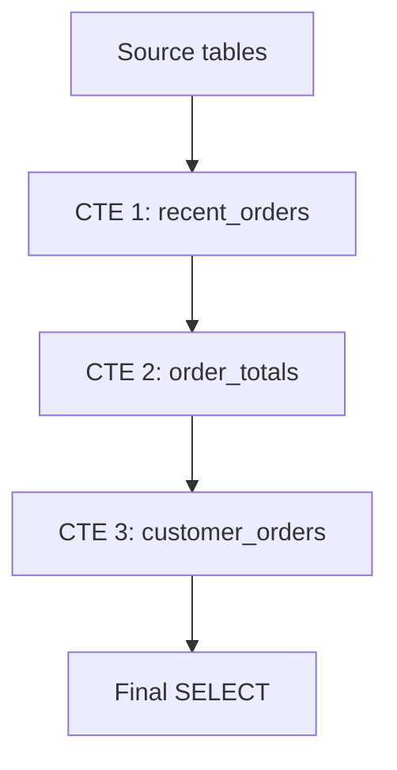

# Techniques pour requêtes maintenables : Modularisation avec des sous-requêtes et CTE  

La modularisation des requêtes SQL est une méthode efficace pour simplifier des requêtes complexes, favoriser la réutilisation, et améliorer la lisibilité et la maintenabilité. Elle s’appuie principalement sur deux techniques : l’usage de **sous-requêtes** et de **Common Table Expressions (CTE)**.  

---

## 1. Sous-requêtes : définition et usage  

Une **sous-requête** est une requête imbriquée à l’intérieur d’une autre. Elle permet d’isoler un calcul ou une extraction particulière qui alimente la requête principale.

### Exemple simple avec sous-requête :

```sql
SELECT customer_id, customer_name
FROM customers
WHERE customer_id IN (
    SELECT customer_id
    FROM orders
    WHERE order_date >= '2024-01-01'
);
```

Ici, la sous-requête extrait les `customer_id` ayant passé des commandes depuis 2024, puis la requête principale récupère leurs informations.

### Avantages des sous-requêtes

- Encapsulation logique d'un calcul spécifique.
- Possibilité de réutilisation multiple selon le contexte.

### Limites  

- Peut vite devenir illisible avec plusieurs niveaux d’imbrication.
- Certaines bases optimisent moins bien les requêtes fortement imbriquées.

---

## 2. Common Table Expressions (CTE) : définition et usage  

Les **CTE** permettent de définir temporairement un résultat intermédiaire nommé à utiliser dans la requête principale, souvent avec la syntaxe `WITH`.  

### Exemple simple avec CTE :

```sql
WITH recent_orders AS (
    SELECT customer_id, order_id, order_date
    FROM orders
    WHERE order_date >= '2024-01-01'
)
SELECT c.customer_name, r.order_id, r.order_date
FROM customers c
JOIN recent_orders r ON c.customer_id = r.customer_id;
```

### Avantages des CTE

- Améliore la lisibilité en nommant clairement les étapes.  
- Facilite le débogage et la maintenance.  
- Possibilité de déclarer plusieurs CTE imbriquées ou successives.  
- Certains SGBD (exemple : PostgreSQL) autorisent les CTE récursives.  

---

## 3. Comparaison succincte  

| Aspect                | Sous-requêtes                         | CTE                                     |
|-----------------------|-------------------------------------|-----------------------------------------|
| Lisibilité            | Peut rapidement se complexifier     | Plus claire grâce à la séparation       |
| Réutilisation         | Limitée dans une même requête       | Multiples références au CTE possible    |
| Optimisation          | Variable selon SGBD                  | Souvent mieux optimisée                  |
| Fonctionnalités       | Simple à utiliser                   | Supporte la récursivité                  |

---

## 4. Exemple avancé avec CTE multiples  

```sql
WITH recent_orders AS (
    SELECT order_id, customer_id, order_date
    FROM orders
    WHERE order_date >= '2024-01-01'
),
order_totals AS (
    SELECT order_id, SUM(quantity * unit_price) AS total_amount
    FROM order_details
    GROUP BY order_id
),
customer_orders AS (
    SELECT ro.customer_id,
           COUNT(ro.order_id) AS nb_orders,
           SUM(ot.total_amount) AS total_spent
    FROM recent_orders ro
    JOIN order_totals ot ON ro.order_id = ot.order_id
    GROUP BY ro.customer_id
)
SELECT c.customer_name,
       co.nb_orders,
       co.total_spent
FROM customers c
JOIN customer_orders co ON c.customer_id = co.customer_id
WHERE co.total_spent > 1000
ORDER BY co.total_spent DESC;
```

Chaque CTE découpe une étape logique, ce qui améliore la clarté et facilite la maintenance.

---

## 5. Diagramme Mermaid illustrant la modularisation  



---

## 6. Bonnes pratiques associées

- **Nommez explicitement vos CTE et sous-requêtes** pour refléter leur fonction.  
- **Commentez vos CTE** pour décrire le rôle de chaque étape.  
- **Préférez les CTE pour des requêtes complexes** nécessitant plusieurs étapes ou une lecture aisée.  
- Analysez les performances : teste les deux approches si le volume de données est large.  

---

## 7. Sources et lectures complémentaires

- [SQL Server Docs - Using Common Table Expressions (CTEs)](https://learn.microsoft.com/en-us/sql/t-sql/queries/with-common-table-expression-transact-sql)  
- [PostgreSQL Documentation - WITH Queries (CTE)](https://www.postgresql.org/docs/current/queries-with.html)  
- [Modern SQL - CTE and Sub-query Usage](https://modern-sql.com/use-case/cte)  
- [Redgate - Improving your T-SQL with CTEs](https://www.red-gate.com/simple-talk/sql/t-sql-programming/improving-your-tsql-with-common-table-expressions/)  

---

Modulariser ses requêtes SQL à l’aide de sous-requêtes et surtout de CTE facilite l’organisation, la lecture et la maintenance du code. Adopter cette approche permet d’écrire des requêtes plus robustes et compréhensibles, notamment dans des contextes décisionnels, analytiques ou d’intégration complexes.