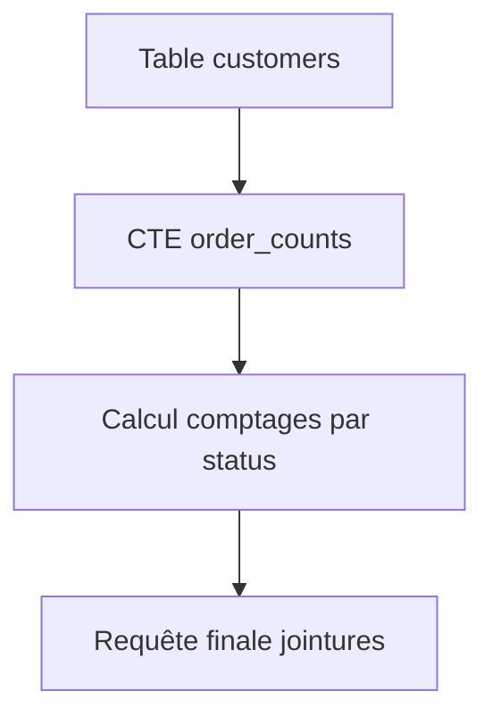

# Techniques pour requêtes maintenables : Éviter les redondances en SQL  

La réduction des redondances dans les requêtes SQL est un levier fondamental pour écrire un code clair, efficace et facile à maintenir. Supprimer les répétitions répétitives évite les erreurs lors des modifications et optimise la performance.  

---

## 1. Impact des redondances dans le SQL

- **Complexité et maintenance difficiles** : modifier en plusieurs endroits augmente le risque d’oublis ou d’incohérences.  
- **Lecture pénible et perte de lisibilité** : rendre la logique difficilement compréhensible.  
- **Exécution inefficace** : répéter des calculs ou jointures coûteuses.  

---

## 2. Causes fréquentes de redondance  

- Répétition des mêmes expressions ou conditions WHERE plusieurs fois.   
- Copie de blocs similaires dans plusieurs parties de la requête (ex : calculs identiques).  
- Duplication des sous-requêtes similaires.  

---

## 3. Techniques pour éviter les redondances

### a) Utiliser des CTE (Common Table Expressions) ou vues temporaires

Isoler et nommer une sous-partie commune à réutiliser :

```sql
WITH active_customers AS (
    SELECT customer_id
    FROM customers
    WHERE status = 'active'
)
SELECT c.customer_id, o.order_id
FROM active_customers c
JOIN orders o ON c.customer_id = o.customer_id
WHERE o.order_date >= '2024-01-01';
```

Ici la condition `status = 'active'` est écrite une fois, réutilisée ensuite.

### b) Employer des alias explicites pour éviter de réécrire des expressions longues

Au lieu de réécrire un calcul complexe plusieurs fois, calculez-le une fois dans une sous-requête ou CTE, puis référencez-le.

```sql
WITH order_totals AS (
    SELECT order_id,
           SUM(quantity * unit_price) AS total_amount
    FROM order_details
    GROUP BY order_id
)
SELECT order_id, total_amount,
       CASE 
           WHEN total_amount > 100 THEN 'High'
           ELSE 'Low'
       END AS order_category
FROM order_totals;
```

### c) Privilégier l’écriture de fonctions ou procédures stockées

Lors d’opérations métiers répétitives, centraliser la logique en procédure stockée réduit la duplication dans plusieurs requêtes.

---

## 4. Exemple d’un refactoring pour éviter la redondance

**Avant :**

```sql
SELECT c.customer_id, c.customer_name,
       (SELECT COUNT(*) FROM orders o WHERE o.customer_id = c.customer_id AND o.status = 'shipped') AS shipped_orders,
       (SELECT COUNT(*) FROM orders o WHERE o.customer_id = c.customer_id AND o.status = 'pending') AS pending_orders
FROM customers c;
```

**Après (avec CTE) :**

```sql
WITH order_counts AS (
    SELECT customer_id,
           SUM(CASE WHEN status = 'shipped' THEN 1 ELSE 0 END) AS shipped_orders,
           SUM(CASE WHEN status = 'pending' THEN 1 ELSE 0 END) AS pending_orders
    FROM orders
    GROUP BY customer_id
)
SELECT c.customer_id, c.customer_name,
       oc.shipped_orders,
       oc.pending_orders
FROM customers c
LEFT JOIN order_counts oc ON c.customer_id = oc.customer_id;
```

Le calcul des commandes par status est fait une fois localement, évitant la répétition de la sous-requête pour chaque type de statut.

---

## 5. Diagramme Mermaid : refactorisation pour éviter des redondances



Cela illustre la séparation claire et l’usage d’un bloc réutilisable.

---

## 6. Résumé des bonnes pratiques anti-redondance SQL  

| Recommandation                        | Avantage                            |
|-------------------------------------|-----------------------------------|
| Exploiter CTE et sous-requêtes nommées | Lisibilité et modularité accrue    |
| Refactoriser les calculs répétitifs | Mise à jour centralisée            |
| Utiliser fonctions stockées          | Réutilisabilité inter-requêtes    |
| Nommer explicitement alias et objets | Clarté et évitement des doublons  |

---

## 7. Sources utilisées  

- [SQL Style Guide - Simon Holywell](https://www.sqlstyle.guide/#common-table-expressions)  
- [Redgate - How to avoid repeating yourself in SQL](https://www.red-gate.com/simple-talk/sql/t-sql-programming/how-to-avoid-repeating-yourself-in-sql/)  
- [DataCamp - SQL Best Practices: Avoiding Redundancies](https://www.datacamp.com/tutorial/sql-best-practices)  
- [Stack Overflow Discussion - Reducing SQL code repetition](https://stackoverflow.com/questions/2775595/how-can-i-avoid-rewriting-the-same-sql-code-multiple-times)  

---

Réduire les redondances dans le SQL est un levier majeur pour rendre le code plus robuste, plus clair et plus performant. La modularisation des expressions et le recours à la factorisation permettent d’obtenir un SQL évolutif et fiable.