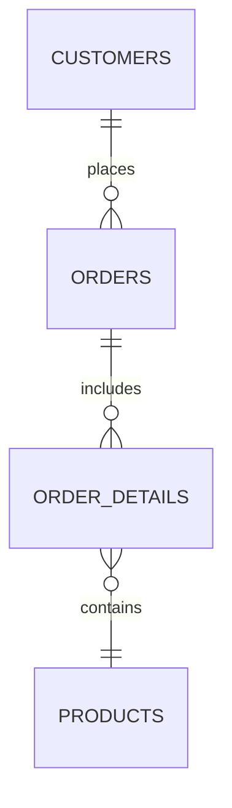

# Techniques pour requêtes maintenables : Gestion des jointures explicites en SQL  

La gestion claire et explicite des jointures est un pilier pour écrire des requêtes SQL lisibles et maintenables. Elle facilite la compréhension, évite les erreurs classiques comme des duplications et garantit des résultats justes.  

---

## 1. Comprendre les jointures explicites

Les jointures explicites utilisent la syntaxe moderne `JOIN ... ON ...` pour associer plusieurs tables. Contrairement à la syntaxe implicite (jointure dans la clause `WHERE`), cette approche :

- Sépare clairement la logique des relations (`JOIN`) des conditions de filtrage (`WHERE`)
- Améliore la lisibilité du code  
- Réduit le risque d’erreurs, notamment de jointures croisées involontaires (produit cartésien)

---

## 2. Types principaux de jointures explicites

| Type de jointure  | Définition                                        | Exemple d’usage                   |
|-------------------|-------------------------------------------------|---------------------------------|
| `INNER JOIN`      | Renvoie les lignes où la condition est vraie dans les deux tables | Relations standard               |
| `LEFT JOIN`       | Renvoie toutes les lignes de la table de gauche et les correspondances de droite ou `NULL` | Pour conserver tous les éléments de la table principale |
| `RIGHT JOIN`      | Similaire au LEFT JOIN, mais pour la table de droite (moins fréquent) | Cas spécifiques                 |
| `FULL OUTER JOIN` | Combine LEFT et RIGHT JOIN                       | Obtenir toutes les lignes, match ou non |

---

## 3. Syntaxe recommandée

```sql
SELECT c.customer_name, o.order_id, o.order_date
FROM customers c
INNER JOIN orders o ON c.customer_id = o.customer_id
WHERE o.order_date >= '2024-01-01';
```

- Le mot-clé `JOIN` est suivi du type précis (`INNER`, `LEFT`, etc.).  
- La condition de jointure est clairement dans `ON`.
- Les filtres sont placés dans la clause `WHERE`, séparément.

---

## 4. Pourquoi préférer les jointures explicites ?

- **Lisibilité accrue** : chaque jointure est clairement annoncée.  
- **Maintenance facilitée** : comprendre et modifier devient beaucoup plus simple.  
- **Meilleure optimisation** : les moteurs SQL optimisent mieux cette syntaxe.  
- **Prévention d'erreurs** : limite les risques de jointures manquantes ou involontaires.

---

## 5. Exemple avancé avec plusieurs jointures explicites

```sql
SELECT c.customer_name, o.order_id, p.product_name, od.quantity
FROM customers c
INNER JOIN orders o ON c.customer_id = o.customer_id
LEFT JOIN order_details od ON o.order_id = od.order_id
LEFT JOIN products p ON od.product_id = p.product_id
WHERE c.status = 'active';
```

Cette requête :

- Joint clients avec leurs commandes (`INNER JOIN` requis).  
- Conserve toutes les commandes même si elles n’ont pas de détails (`LEFT JOIN`).  
- Associe les produits correspondants si disponibles (`LEFT JOIN`).  

---

## 6. Diagramme Mermaid illustrant la gestion des jointures  



Cette modélisation reflète l’organisation des jointures dans la requête d’exemple.

---

## 7. Bonnes pratiques supplémentaires

- Toujours utiliser la syntaxe JOIN explicite.  
- Documenter la raison des choix de type de jointure (ex : LEFT JOIN pour garder tous les clients).  
- Éviter de mélanger syntaxe JOIN et syntaxe implicite.  
- Attention aux jointures multiples : indenter clairement les passages pour plus de lisibilité.  

---

## 8. Sources à jour

- [PostgreSQL Docs - JOIN Overview](https://www.postgresql.org/docs/current/tutorial-join.html)  
- [Microsoft Docs - FROM (Transact-SQL) — JOIN](https://learn.microsoft.com/en-us/sql/t-sql/queries/from-transact-sql?view=sql-server-ver16)  
- [SQLStyle.Guide - JOINs](https://www.sqlstyle.guide/#joins)  
- [Redgate - SQL JOINs Explained](https://www.red-gate.com/simple-talk/sql/t-sql-programming/sql-join-types-explained/)  

---

Utiliser des jointures explicites est une pratique incontournable pour écrire un SQL lisible, fiable et performant. Elles structurent la relation entre tables de façon claire et séparent la jointure des conditions métier, rendant le code bien plus facile à comprendre et à maintenir.