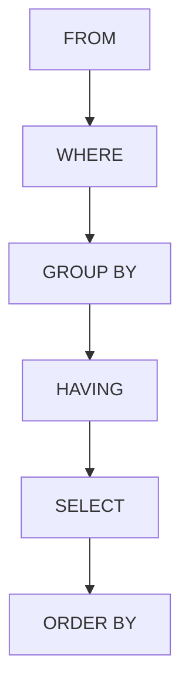

# Optimisation de la lisibilité : Clarté dans l'ordre des clauses SQL  

L’ordre des clauses dans une requête SQL n’est pas arbitraire, il suit une logique d’exécution que la lisibilité doit refléter. Présenter les clauses dans un ordre clair et cohérent facilite la compréhension, l’écriture et la maintenance des requêtes.  

---

## 1. Ordre canonique des clauses SQL et leur fonction  

Les clauses principales s'écrivent dans l’ordre suivant :  
```sql
SELECT ...  
FROM ...  
WHERE ...  
GROUP BY ...  
HAVING ...  
ORDER BY ...  
```

| Clause    | Rôle principal                                        |
|-----------|-----------------------------------------------------|
| SELECT    | Liste les colonnes ou expressions à retourner      |
| FROM      | Spécifie les tables sources ou sous-requêtes       |
| WHERE     | Filtre les lignes avant aggregation                  |
| GROUP BY  | Agrège les données selon une ou plusieurs colonnes   |
| HAVING    | Filtre les groupes après agrégation                  |
| ORDER BY  | Trie les résultats selon une ou plusieurs colonnes   |

---

## 2. Pourquoi respecter cet ordre dans la lecture et l’écriture ?  

- **Correspondance à l’ordre logique d’exécution** :  
  En réalité, le moteur exécute d’abord `FROM` puis `WHERE`, ensuite `GROUP BY` et `HAVING`, enfin `SELECT` et `ORDER BY`.  
- **Clarté pour le lecteur** :  
  Suivre cet ordre garde un fil conducteur logique.  
- **Facilité de débogage** :  
  Chaque étape est claire et indépendante  
- **Uniformité entre projets et équipes**  

---

## 3. Exemple illustré

Requête simple avec toutes les clauses :

```sql
SELECT department, COUNT(employee_id) AS nb_employees, AVG(salary) AS avg_salary
FROM employees
WHERE hire_date >= '2020-01-01'
GROUP BY department
HAVING COUNT(employee_id) > 5
ORDER BY avg_salary DESC;
```

- `FROM employees` : sélectionne la source  
- `WHERE hire_date >= '2020-01-01'` : filtre les employés récents  
- `GROUP BY department` : regroupe par département  
- `HAVING COUNT(employee_id) > 5` : filtre les groupes trop petits  
- `SELECT ...` : définit colonnes et calculs de sortie  
- `ORDER BY avg_salary DESC` : trie par salaire moyen décroissant  

---

## 4. Diagramme Mermaid : flux d’exécution des clauses  



---

## 5. Conseils pour une écriture claire  

- Toujours aligner les clauses et utiliser une clause par ligne.   
- Mettre les mots-clés SQL en majuscules pour les distinguer.  
- Aligner verticalement les plusieurs colonnes dans le `SELECT` ou `GROUP BY`.  
- Rédiger la clause `WHERE` avant la `GROUP BY` pour clarifier le filtrage en amont.  
- Utiliser toujours `HAVING` **après** une agrégation plutôt que dans le `WHERE`.   

---

## 6. Erreurs courantes à éviter  

- Placer une condition de filtre d’agrégation dans le `WHERE` (ex : `WHERE COUNT(...) > 5`) qui provoque une erreur.  
- Confondre l’ordre d’écriture qui impacte la compréhension même si l’exécution est rigoureusement gérée par le moteur.  
- Écrire plusieurs clauses sur la même ligne, ce qui nuit à la lisibilité.  

---

## 7. Sources fiables et mises à jour  

- [SQL Standard and Execution Order – Mode Analytics](https://mode.com/sql-tutorial/sql-clauses/#order-of-execution)  
- [PostgreSQL Documentation – SELECT](https://www.postgresql.org/docs/current/sql-select.html)  
- [SQL Style Guide – Simon Holywell](https://www.sqlstyle.guide/#order-select-from-where-group-by-having-order-by)  
- [Redgate – SQL query order and readability](https://www.red-gate.com/simple-talk/sql/t-sql-programming/sql-query-structure-to-enhance-readability/)  

---

## 8. En résumé  

Un bon usage de l’ordre des clauses dans une requête SQL est un facteur clef pour garantir la lisibilité du code. Structurer et aligner les clauses selon cet ordre naturel guide la lecture logique et facilite la maintenance, même pour les requêtes complexes.