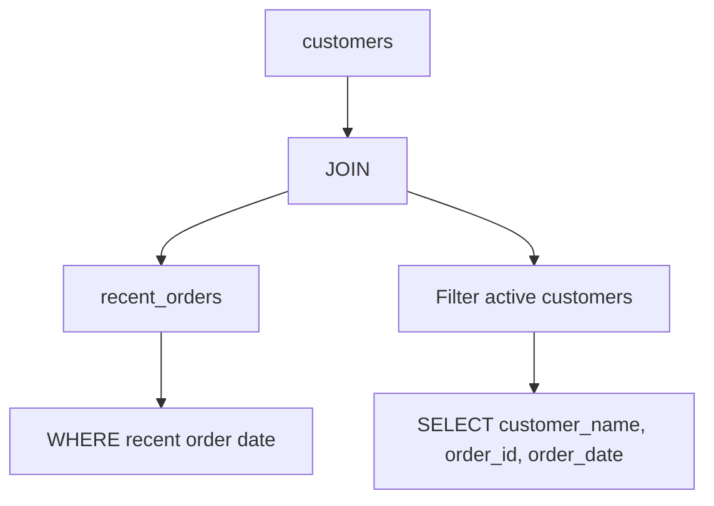

# Optimisation de la lisibilité : Exemples pratiques sur PostgreSQL  

PostgreSQL, par ses fonctionnalités avancées et sa robustesse, offre un terrain idéal pour appliquer les meilleures pratiques de lisibilité et maintenabilité des requêtes SQL. Ce guide présente des exemples concrets exploitant les standards et spécificités PostgreSQL pour un code clair, lisible et performant.  

---

## 1. Formatage standardisé avec CTE et jointures explicites  

La lisibilité commence par un formatage soigné et l’usage des **Common Table Expressions (CTE)** pour modulariser la requête. Les jointures explicites clarifient les relations entre tables.  

### Exemple : Consultation des clients avec leurs commandes récentes

```sql
WITH recent_orders AS (
    SELECT
        order_id,
        customer_id,
        order_date
    FROM orders
    WHERE order_date >= CURRENT_DATE - INTERVAL '30 days'
)
SELECT
    c.customer_name,
    ro.order_id,
    ro.order_date
FROM customers c
INNER JOIN recent_orders ro ON c.customer_id = ro.customer_id
WHERE c.status = 'active'
ORDER BY ro.order_date DESC;
```

Cet exemple illustre :  
- La modularisation avec `WITH`  
- Des clauses bien alignées et commentées implicitement par la structure  
- Jointures explicites pour éviter toute ambiguïté  

---

## 2. Filtrage clair entre WHERE et HAVING

PostgreSQL respecte strictement la distinction entre filtres ligne (`WHERE`) et filtres sur groupes (`HAVING`).  

### Exemple : filtrer les départements ayant plus de 5 employés embauchés après 2020  

```sql
SELECT
    department,
    COUNT(employee_id) AS nb_employees
FROM employees
WHERE hire_date >= '2020-01-01'
GROUP BY department
HAVING COUNT(employee_id) > 5
ORDER BY nb_employees DESC;
```

On observe :  
- `WHERE` filtre les données brutes  
- `HAVING` agit sur les groupes agrégés  
- Clauses ordonnées selon les standards expliqués précédemment  

---

## 3. Utilisation de fonctions PostgreSQL pour améliorer la lisibilité  

PostgreSQL propose une large palette de fonctions utiles, notamment des fonctions analytiques qui permettent de conserver la clarté tout en réalisant des calculs avancés.  

### Exemple : Calcul du rang des clients selon le montant total des commandes  

```sql
SELECT
    customer_id,
    SUM(amount) AS total_spent,
    RANK() OVER (ORDER BY SUM(amount) DESC) AS spending_rank
FROM orders
GROUP BY customer_id
ORDER BY spending_rank;
```

- La fonction `RANK()` est intégrée dans la requête, évitant des sous-requêtes supplémentaires  
- La syntaxe analytique permet de combiner agrégation et classement dans une requête claire

---

## 4. Exemples illustrés avec diagramme Mermaid  

Le schéma suivant modélise la requête du paragraphe 1, montrant clairement la structure modulaire.



---

## 5. Outils pour le formatage et vérification  

- **pgFormatter** ([GitHub](https://github.com/darold/pgFormatter)) : outil open source pour formater automatiquement vos scripts PostgreSQL.  
- Extensions comme **SQLBeautify** ou **SQLFluff** (support PostgreSQL) pour IDE.  
- Analyseur de style intégré dans certains IDE (DBeaver, DataGrip).  

---

## 6. Sources fiables et documentations officielles  

- [PostgreSQL Documentation - SELECT](https://www.postgresql.org/docs/current/sql-select.html)  
- [PostgreSQL Documentation - CTE and Subqueries](https://www.postgresql.org/docs/current/queries-with.html)  
- [Mode Analytics - SQL Style Guide](https://mode.com/sql-tutorial/sql-style-guide/)  
- [pgFormatter GitHub repository](https://github.com/darold/pgFormatter)  
- [SQLFluff - SQL linter & formatter](https://www.sqlfluff.com/)  

---

## Conclusion  

Bien structurer ses requêtes PostgreSQL, utiliser CTE, distinguer clairement `WHERE` et `HAVING`, et exploiter les fonctions analytiques améliore fortement la lisibilité. Couplé avec un formatage standardisé, cela facilite la maintenance et la compréhension, deux qualités indispensables à la qualité du code SQL.