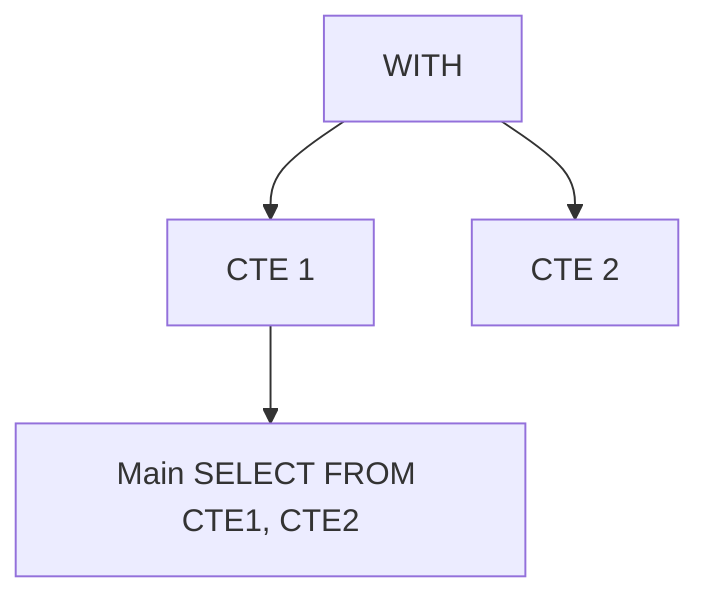

# Introduction aux CTE (Common Table Expressions) : Syntaxe et structure  

Les Common Table Expressions (CTE) sont un moyen puissant et lisible de structurer les requêtes SQL complexes. Elles permettent de définir temporairement des résultats intermédiaires, facilitant la décomposition des requêtes tout en améliorant la clarté et la maintenabilité.

---

## 1. Syntaxe de base d’un CTE

Un CTE est introduit par le mot-clé `WITH`, suivi d’un ou plusieurs noms d’expressions représentant des sous-requêtes temporaires :

```sql
WITH cte_name (column1, column2, ...) AS (
    -- requête SQL retournant des colonnes correspondantes
    SELECT ...
)
SELECT ...
FROM cte_name
WHERE ...;
```

- `cte_name` est le nom de l’expression temporaire.  
- La liste optionnelle `(column1, column2, ...)` précise les noms des colonnes renvoyées.  
- La requête entre parenthèses définit le contenu du CTE.  
- Le CTE est utilisé ensuite dans la requête principale comme une table.

---

## 2. Exemple simple

```sql
WITH high_salary_employees AS (
    SELECT employee_id, name, salary
    FROM employees
    WHERE salary > 70000
)
SELECT employee_id, name
FROM high_salary_employees
ORDER BY name;
```

Ici, `high_salary_employees` est une table temporaire qui filtre les employés avec un salaire élevé. La requête principale sélectionne ensuite ces employés.

---

## 3. Utilisation de plusieurs CTE en chaîne

On peut définir plusieurs CTE successives, séparées par des virgules :

```sql
WITH 
cte1 AS (
    SELECT ...
),
cte2 AS (
    SELECT ...
)
SELECT ...
FROM cte1
JOIN cte2 ON ...;
```

Cela permet d’organiser un calcul complexe en étapes claires.

---

## 4. CTE récursifs (introduits avec `RECURSIVE`)

Les CTE peuvent être récursifs, utiles pour parcourir des structures hiérarchiques (exemple : arbre, organisation).

Syntaxe :

```sql
WITH RECURSIVE cte_name AS (
    -- requête d’ancrage (base)
    SELECT ...
    UNION ALL
    -- requête récursive s’appuyant sur cte_name
    SELECT ... FROM cte_name WHERE ...
)
SELECT * FROM cte_name;
```

---

## 5. Diagramme Mermaid : structure classique avec CTE  

```mermaid
flowchart TD
    A[WITH cte_name AS (sub-query)] --> B[Main SELECT]
    B --> C[From cte_name]
```

Pour plusieurs CTEs en chaîne :  



---

## 6. Avantages clés des CTE  

- **Lisibilité** : découpage en étapes logiques.  
- **Réutilisation** : évite de répéter identiques sous-requêtes.  
- **Maintenance facilitée** : modification localisée.  
- **Support pour SQL récursif** : expressions hiérarchiques.  

---

## 7. Références récentes  

- [PostgreSQL Documentation - WITH (Common Table Expressions)](https://www.postgresql.org/docs/current/queries-with.html)  
- [SQL Server Docs - WITH common_table_expression](https://docs.microsoft.com/en-us/sql/t-sql/queries/with-common-table-expression-transact-sql)  
- [Mode Analytics - SQL CTE Guide](https://mode.com/sql-tutorial/sql-common-table-expressions/)  
- [SQLStyle.Guide - Common Table Expressions](https://www.sqlstyle.guide/#common-table-expressions)  

---

## 8. Conclusion  

Le CTE est une construction SQL fondamentale pour écrire des requêtes complexes avec une véritable hiérarchie lisible. Sa maîtrise permet de rendre les scripts SQL modulaires, réutilisables et plus simples à maintenir.