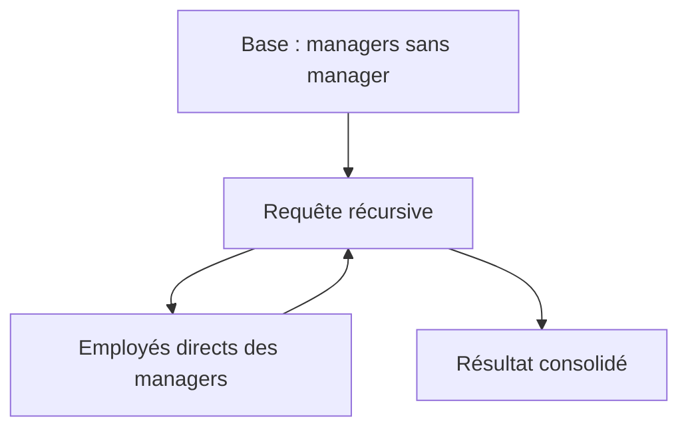

# Usage classique vs récursif des CTE (Common Table Expressions)  

Les Common Table Expressions (CTE) sont des structures SQL qui facilitent la structuration des requêtes. Deux usages majeurs coexistent : les CTE classiques, pour simplifier et modulariser une requête, et les CTE récursifs, conçus pour manipuler des données hiérarchiques ou des calculs itératifs.

---

## 1. Usage classique des CTE  

Le CTE classique sert à créer une sous-requête temporaire nommée, utilisée ensuite comme une table. Cela améliore la lisibilité et évite les répétitions.

### Exemple

Lister les employés avec un salaire supérieur à 60 000, puis afficher leur nom et salaire :

```sql
WITH high_salary AS (
    SELECT employee_id, name, salary
    FROM employees
    WHERE salary > 60000
)
SELECT name, salary
FROM high_salary
ORDER BY salary DESC;
```

Ici, `high_salary` agit comme une table temporaire isolant le filtrage, la requête finale opérant simplement dessus.

---

## 2. Usage récursif des CTE  

Le CTE récursif permet une requête qui s'appelle elle-même, utile pour retrouver des données liées de manière arborescente, comme une hiérarchie d’employés ou un graphe.

### Syntaxe générale

```sql
WITH RECURSIVE cte_name AS (
    -- cas de base
    SELECT ...
    UNION ALL
    -- appel récursif sur la CTE
    SELECT ...
    FROM cte_name
    WHERE ...
)
SELECT * FROM cte_name;
```

### Exemple : hiérarchie d’employés et leurs managers

Imaginons une table `employees` avec les colonnes `(employee_id, name, manager_id)`.  

```sql
WITH RECURSIVE employee_hierarchy AS (
    -- cas de base : les managers de premier niveau (sans manager)
    SELECT employee_id, name, manager_id, 1 AS level
    FROM employees
    WHERE manager_id IS NULL
    
    UNION ALL
    
    -- cas récursif : on cherche les employés des managers précédents
    SELECT e.employee_id, e.name, e.manager_id, eh.level + 1
    FROM employees e
    INNER JOIN employee_hierarchy eh ON e.manager_id = eh.employee_id
)
SELECT employee_id, name, manager_id, level
FROM employee_hierarchy
ORDER BY level, manager_id;
```

Cette requête remonte toute la chaîne hiérarchique, en affectant un niveau (profondeur) à chaque employé.

---

## 3. Différences clés entre usage classique et récursif  

| Critère              | CTE Classique                      | CTE Récursif                                      |
|----------------------|----------------------------------|--------------------------------------------------|
| But                  | Simplifier/modulariser requêtes  | Parcourir structures hiérarchiques/itératives    |
| Structure            | Sous-requête unique               | Un cas de base + clause récursive (UNION ALL)    |
| Exécution            | Simple, une seule exécution       | Exécutée récursivement jusqu’à convergence       |
| Utilisation typique  | Filtrage, jointures, agrégations | Arbres, graphes, génération de séries            |

---

## 4. Diagramme Mermaid illustratif  

Pour un CTE récursif en hiérarchie :



---

## 5. Sources à jour  

- [PostgreSQL Documentation - WITH Queries (CTE)](https://www.postgresql.org/docs/current/queries-with.html)  
- [SQL Server Docs - Recursive CTE](https://docs.microsoft.com/en-us/sql/t-sql/queries/with-common-table-expression-transact-sql#recursive-ctes)  
- [Mode Analytics - Recursive CTE Tutorial](https://mode.com/sql-tutorial/sql-recursive-cte/)  
- [SQLStyle.Guide - Common Table Expressions](https://www.sqlstyle.guide/#common-table-expressions)  

---

## 6. Résumé  

- Le CTE classique sert à découper et clarifier les requêtes.  
- Le CTE récursif apporte la puissance d’une boucle itérative dans un langage SQL déclaratif, parfaite pour les données hiérarchiques.  
- La maîtrise des deux formes étend considérablement le champ d’action et la clarté du SQL complexe.