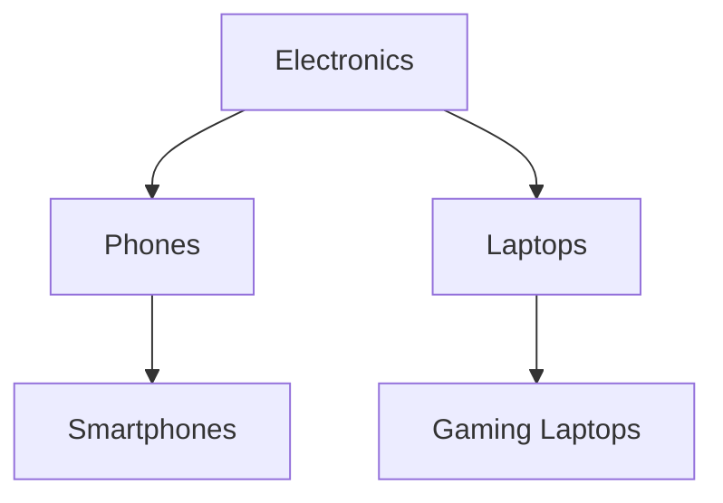

# Mise en œuvre des CTE récursifs sur arbres hiérarchiques  

Les CTE récursifs sont parfaitement adaptés à la manipulation des données structurées en hiérarchie, comme les arbres généalogiques, les organigrammes, ou les catalogues en arborescence. Grâce à eux, il est possible d’explorer récursivement des arbres directement en SQL, évitant ainsi des traitements coûteux côté application.

---

## 1. Principe d’un CTE récursif pour arbre hiérarchique  

Une table typique pour modéliser une hiérarchie contient :  
- un identifiant unique de nœud (`id`)  
- un lien vers le parent (`parent_id`)  

Le CTE récursif démarre par la **requête de base** qui sélectionne la ou les racines (`parent_id IS NULL`). Puis, la partie récursive rejoint la CTE elle-même pour récupérer les enfants des nœuds déjà sélectionnés.

---

## 2. Exemple concret avec une table `categories`  

Schéma simplifié :  
| category_id | category_name | parent_id |  
|-------------|---------------|-----------|  
| 1           | Electronics   | NULL      |  
| 2           | Phones        | 1         |  
| 3           | Laptops       | 1         |  
| 4           | Smartphones   | 2         |  
| 5           | Gaming Laptops| 3         |  

---

### Requête récursive pour parcourir toute la hiérarchie

```sql
WITH RECURSIVE category_tree AS (
    -- étape 1 : racines
    SELECT category_id, category_name, parent_id, 1 AS level
    FROM categories
    WHERE parent_id IS NULL

    UNION ALL

    -- étape récursive : récupère les enfants directs
    SELECT c.category_id, c.category_name, c.parent_id, ct.level + 1
    FROM categories c
    INNER JOIN category_tree ct ON c.parent_id = ct.category_id
)
SELECT *
FROM category_tree
ORDER BY level, parent_id, category_name;
```

---

### Résultat (extrait)  

| category_id | category_name   | parent_id | level |  
|-------------|-----------------|-----------|-------|  
| 1           | Electronics     | NULL      | 1     |  
| 2           | Phones          | 1         | 2     |  
| 3           | Laptops         | 1         | 2     |  
| 4           | Smartphones     | 2         | 3     |  
| 5           | Gaming Laptops  | 3         | 3     |  

Le champ `level` indique la profondeur dans l’arbre.

---

## 3. Visualisation de la récursivité avec Mermaid  



---

## 4. Utiliser la récursion pour d’autres cas  

- **Organigramme d’entreprise** : hiérarchie employés/managers  
- **Gestion des dossiers/fichiers** : navigation dans un système d’arborescence  
- **Descendance d’entités** sur plusieurs niveaux  

---

## 5. Points d’attention  

- Le CTE récursif doit toujours contenir un **cas de base** (ex. racine) pour éviter une boucle infinie.  
- Assurer une **clause de terminaison** logique (typiquement, disparition des enfants).  
- Certains SGBD posent une limite à la récursion (ex : 100 par défaut en PostgreSQL). Elle est modifiable avec `SET max_recursion_depth`.  

---

## 6. Ressources et documentations officielles  

- [PostgreSQL Recursive Queries (WITH RECURSIVE)](https://www.postgresql.org/docs/current/queries-with.html)  
- [SQL Server Recursive CTE](https://docs.microsoft.com/en-us/sql/t-sql/queries/with-common-table-expression-transact-sql#recursive-ctes)  
- [Oracle Hierarchical Queries Guide](https://docs.oracle.com/cd/B19306_01/server.102/b14200/queries006.htm)  
- [Mode Analytics Tutorial on Recursive CTE](https://mode.com/sql-tutorial/sql-recursive-cte/)  

---

## 7. Conclusion  

Les CTE récursifs transforment SQL en un langage capable de naviguer dans les structures de données hiérarchiques avec élégance et performance. Leur mise en œuvre s’appuie sur une division claire entre cas de base et étape récursive, donnant un contrôle précis sur la profondeur et l’étendue de la récursion.