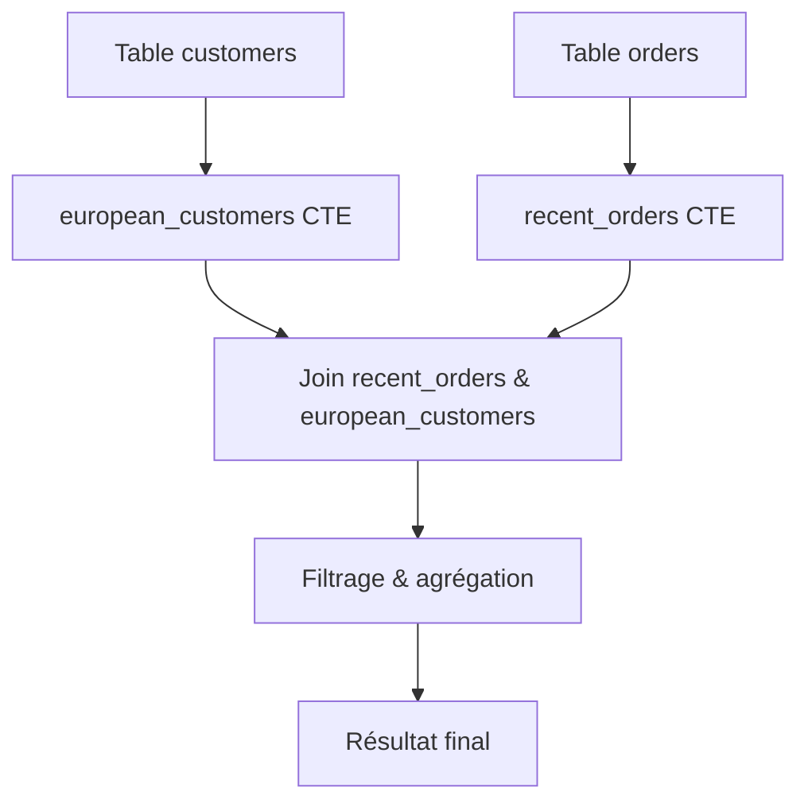

# Lisibilité et décomposition des requêtes avec les CTE (Common Table Expressions)

Les Common Table Expressions (CTE) sont un outil puissant pour améliorer la lisibilité et la structure des requêtes SQL. En scindant une requête complexe en blocs logiques indépendants, les CTE rendent le code plus clair, plus maintenable et souvent plus performant. Cet article explique comment les CTE favorisent une meilleure organisation du SQL, avec des pratiques recommandées illustrées par des exemples concrets.

---

## 1. Avantages en termes de lisibilité  

- **Isolation des étapes** : Chaque CTE agit comme une sous-requête nommée, décrivant une étape précise du raisonnement.  
- **Réduction de la complexité** : On évite les longues sous-requêtes imbriquées qui rendent le SQL difficile à comprendre.  
- **Noms explicites** : Donner des noms significatifs aux CTE facilite la compréhension immédiate de leur rôle.  
- **Séparation logique** : Diviser calculs, filtrages, agrégations permet de suivre le flux de données étape par étape.  

### Exemple sans CTE (plus difficile à lire)

```sql
SELECT customer_id, SUM(amount) total_spent
FROM orders
WHERE order_date >= '2023-01-01' AND customer_id IN (
    SELECT customer_id
    FROM customers
    WHERE region = 'Europe'
)
GROUP BY customer_id
HAVING SUM(amount) > 1000;
```

### Même requête réécrite avec CTE

```sql
WITH european_customers AS (
    SELECT customer_id
    FROM customers
    WHERE region = 'Europe'
),
recent_orders AS (
    SELECT customer_id, amount
    FROM orders
    WHERE order_date >= '2023-01-01'
)
SELECT ro.customer_id, SUM(ro.amount) AS total_spent
FROM recent_orders ro
JOIN european_customers ec ON ro.customer_id = ec.customer_id
GROUP BY ro.customer_id
HAVING SUM(ro.amount) > 1000;
```

La version avec CTE rend explicites les différents segments de traitement, ce qui simplifie le débogage et la maintenance.

---

## 2. Meilleures pratiques pour la décomposition des requêtes  

- **Nommer clairement les CTE** : Exemple : `filtered_customers`, `aggregated_sales`.  
- **Limiter la taille de chaque CTE** : Une étape = une logique métier claire, sans surcharge.  
- **Utiliser les CTE pour partager un résultat intermédiaire** si utilisé plusieurs fois dans la requête.  
- **Documenter brièvement par des commentaires** les objectifs de chaque CTE.  
- **Privilégier les CTE aux sous-requêtes imbriquées pour meilleure lisibilité**, même si les performances doivent être confirmées sur chaque cas via plans d’exécution.  

---

## 3. Exemple avancé : calcul des clients actifs avec score de fidélité

```sql
WITH active_customers AS (
    SELECT customer_id
    FROM orders
    WHERE order_date > CURRENT_DATE - INTERVAL '6 months'
    GROUP BY customer_id
),
loyalty_score AS (
    SELECT customer_id, COUNT(DISTINCT order_date) AS visit_days
    FROM orders
    GROUP BY customer_id
)
SELECT ac.customer_id, ls.visit_days
FROM active_customers ac
JOIN loyalty_score ls ON ac.customer_id = ls.customer_id
WHERE ls.visit_days > 10
ORDER BY ls.visit_days DESC;
```

---

## 4. Diagramme Mermaid : Décomposition avec CTE



---

## 5. Références et ressources  

- [PostgreSQL Documentation – WITH Queries](https://www.postgresql.org/docs/current/queries-with.html)  
- [Mode Analytics - SQL Common Table Expressions](https://mode.com/sql-tutorial/sql-common-table-expressions/)  
- [SQLStyle.Guide - Using CTEs](https://www.sqlstyle.guide/#common-table-expressions)  
- [Blog SQL Shack – Advantages of Common Table Expressions](https://www.sqlshack.com/introduction-to-common-table-expressions-cte-in-sql-server/)  

---

## Conclusion  

La décomposition des requêtes via les CTE conduit à un SQL plus modulaire, lisible et maintenable. Elle permet d’exprimer clairement chaque étape de traitement, améliore la collaboration entre développeurs et facilite la maintenance évolutive. Pour exploiter pleinement cette puissance, il convient d’adopter des conventions de nommage claires et de structurer chaque CTE autour d’un objectif unique.