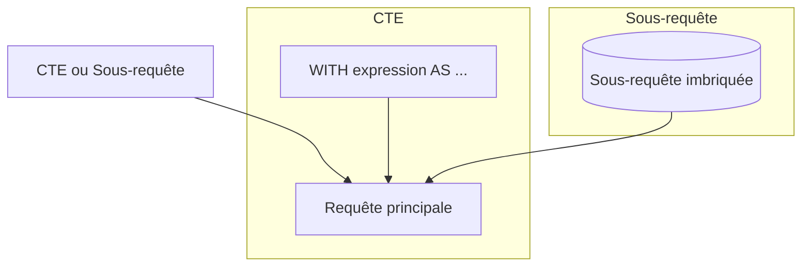

# Comparaison entre Common Table Expressions (CTE) et sous-requêtes classiques  

Les Common Table Expressions (CTE) ont été introduites pour améliorer la structure, la lisibilité et la réutilisabilité des requêtes SQL. Pourtant, les sous-requêtes classiques (imbriquées dans la clause FROM ou WHERE) restent encore très utilisées. Cet article compare ces deux techniques, en exposant leurs atouts, limites et différences concrètes, afin d’aider à choisir la meilleure approche selon le contexte.

---

## 1. Syntaxe et lisibilité  

### Sous-requête classique

La sous-requête est directement imbriquée dans la requête principale, ce qui peut rendre le code dense et plus difficile à décomposer :

```sql
SELECT customer_id, total_orders
FROM (
    SELECT customer_id, COUNT(*) AS total_orders
    FROM orders
    WHERE order_date >= '2023-01-01'
    GROUP BY customer_id
) AS recent_orders
WHERE total_orders > 5;
```

### Équivalent avec CTE

```sql
WITH recent_orders AS (
    SELECT customer_id, COUNT(*) AS total_orders
    FROM orders
    WHERE order_date >= '2023-01-01'
    GROUP BY customer_id
)
SELECT customer_id, total_orders
FROM recent_orders
WHERE total_orders > 5;
```

> **Avantage CTE :** nommage explicite des étapes, ce qui améliore la clarté et documente implicitement la logique.

---

## 2. Réutilisation et maintenance  

- **Sous-requêtes** : On répète souvent les mêmes sous-requêtes si elles sont utilisées plusieurs fois, ce qui rend les requêtes longues et plus difficiles à modifier.  
- **CTE** : Permettent de définir une fois un bloc réutilisable dans la requête principale, évitant ainsi les doublons.

### Exemple : réutilisation dans une requête

```sql
WITH filtered_orders AS (
    SELECT * FROM orders WHERE order_date >= '2023-01-01'
)
SELECT 
    customer_id, 
    COUNT(*) AS num_orders,
    SUM(amount) AS total_amount
FROM filtered_orders
GROUP BY customer_id
HAVING COUNT(*) > 10
ORDER BY total_amount DESC;
```

Ici `filtered_orders` peut être utilisé plusieurs fois dans une requête complexe.

---

## 3. Performance et optimisation  

- Les moteurs SQL convertissent généralement les CTE en sous-requêtes ou en tables temporaires internes.  
- Dans certains systèmes (ex. SQL Server), une CTE est un simple "alias" syntaxique et ne matérialise pas le résultat, tandis que les sous-requêtes imbriquées peuvent être optimisées différemment.  
- Les CTE récursifs ont des traitements spécifiques et ne peuvent généralement pas être remplacés par des sous-requêtes simples.  

> **Bonnes pratiques** : Toujours analyser le plan d’exécution pour identifier les impacts réels des CTE vs sous-requêtes dans le contexte spécifique.

---

## 4. Fonctionnalités spécifiques  

- **CTE récursifs** : Inexistants avec les sous-requêtes classiques.  
- **Clarté des requêtes complexes** : CTE idéaux pour séparer la logique en étapes, ce qui est compliqué avec des sous-requêtes imbriquées multiples.

---

## 5. Illustration Mermaid



---

## 6. Sources et ressources  

- [PostgreSQL Documentation - WITH Queries](https://www.postgresql.org/docs/current/queries-with.html)  
- [Microsoft Docs - Common Table Expressions](https://docs.microsoft.com/en-us/sql/t-sql/queries/with-common-table-expression-transact-sql)  
- [Mode Analytics - Using CTEs vs Subqueries](https://mode.com/sql-tutorial/sql-common-table-expressions/)  
- [SQL Performance Explained - CTE vs Derived Tables](https://sql-performance-explained.com/cte-vs-derived-tables/)  

---

## 7. Conclusion  

Les CTE offrent un cadre syntaxique structurant qui améliore la lisibilité et facilite la maintenance des requêtes complexes. Les sous-requêtes classiques restent adaptées pour des cas simples ou ponctuels. Le choix doit s’appuyer sur la nature de la requête, la nécessité de réutilisation des résultats intermédiaires, et la vérification du plan d’exécution. Les CTE récursifs restent incontournables pour les explorations hiérarchiques.