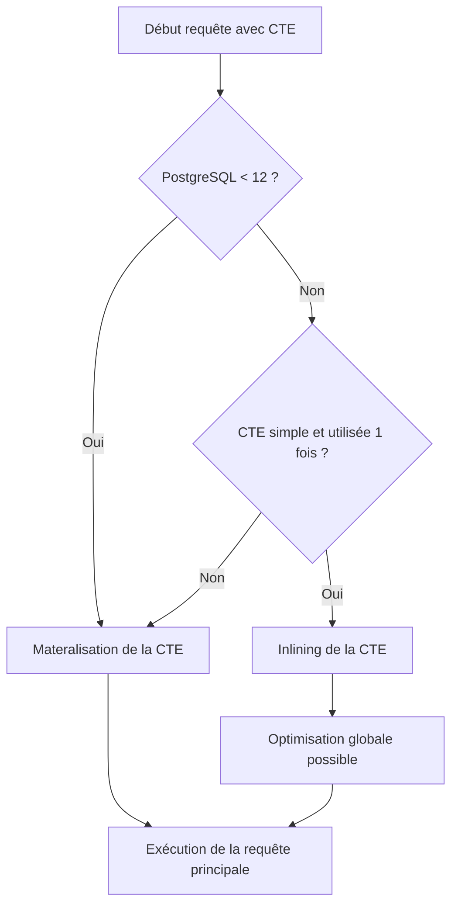

# Impact des Common Table Expressions (CTE) sur les performances dans PostgreSQL

Les Common Table Expressions (CTE) sont largement utilisées pour améliorer la lisibilité et la modularité du SQL. Cependant, leur utilisation peut avoir des conséquences importantes sur les performances, notamment dans PostgreSQL. Cet article analyse comment PostgreSQL traite les CTE, les enjeux de performance associés, et propose des bonnes pratiques pour les optimiser.

---

## 1. Le traitement des CTE dans PostgreSQL  

Jusqu'à la version 12, PostgreSQL traite chaque CTE (**`WITH`**) comme une **vue matérialisée temporairement**. Cela signifie que le résultat de la requête dans la CTE est entièrement calculé, matérialisé en mémoire (ou disque), puis utilisé par la requête principale. Cette matérialisation assure une séparation claire entre les étapes, mais a un coût en performances.

À partir de PostgreSQL 12, une option appelée **inlineable CTE** a été introduite, où PostgreSQL peut décider d’inliner une CTE dans la requête principale pour une exécution plus efficace si la CTE est simple et utilisée une seule fois.

---

## 2. Conséquences sur les performances  

### 2.1. Avantages de la matérialisation (avant v12)  
- Garantit la constance des résultats, utile en cas de modifications concurrentes sur les tables sources.  
- Permet d’économiser des calculs si la CTE est utilisée plusieurs fois.

### 2.2. Inconvénients  
- Coût mémoire/disk pour stocker le résultat intermédiaire.  
- Impossibilité pour l’optimiseur d’inclure la CTE dans l’optimisation globale de la requête (pas de “push-down” des filtres).  
- Peu efficace pour des CTE complexes ou volumineux, notamment si seuls quelques résultats sont nécessaires dans la requête principale.

---

## 3. Exemples illustratifs

### Exemple 1 : CTE matérialisée

```sql
WITH recent_orders AS (
  SELECT * FROM orders WHERE order_date >= '2024-01-01'
)
SELECT customer_id, COUNT(*) FROM recent_orders GROUP BY customer_id;
```

Dans PostgreSQL 11 et antérieur, `recent_orders` sera exécutée et stockée intégralement avant la requête finale.

---

### Exemple 2 : CTE inlinée en PostgreSQL 12+

Si la CTE est simple et utilisée une seule fois, PostgreSQL peut transformer la requête en sous-requête imbriquée, évitant la matérialisation, ce qui peut considérablement améliorer les performances.

---

## 4. Comment forcer ou empêcher l'inlining  

- **Forcer la matérialisation :** Utiliser `MATERIALIZED` explicitement (PostgreSQL 12+)  
  ```sql
  WITH MATERIALIZED recent_orders AS ( ... )
  ```
- **Empêcher la matérialisation (favoriser l’inlining) :** Utiliser `NOT MATERIALIZED`  
  ```sql
  WITH NOT MATERIALIZED recent_orders AS ( ... )
  ```

---

## 5. Bonnes pratiques pour optimiser les CTE dans PostgreSQL  

- Privilégier les CTE simples et utilisées une seule fois pour bénéficier de l’inlining automatique.  
- Éviter d’utiliser des CTE lourds qui seront matérialisés, particulièrement dans des requêtes sensibles à la performance.  
- Utiliser `NOT MATERIALIZED` pour empêcher la matérialisation quand vous savez que la CTE peut être inlinée.  
- Vérifier le plan d’exécution avec `EXPLAIN ANALYZE` pour constater si la CTE est matérialisée ou pas.  
- Considérer d’autres constructeurs SQL (sous-requêtes dérivées, vues) si le comportement matériel n’est pas souhaité.

---

## 6. Diagramme Mermaid : Flux d’exécution des CTE selon la version PostgreSQL



---

## 7. Sources et références  

- [PostgreSQL Official Documentation - WITH Queries](https://www.postgresql.org/docs/current/queries-with.html)  
- [PostgreSQL 12 Release Notes - CTE Inlining](https://www.postgresql.org/docs/12/release-12.html#CTE-INLINING)  
- [Severalnines - Performance Considerations of PostgreSQL CTEs](https://severalnines.com/blog/common-table-expressions-cte-postgresql-performance-optimization)  
- [Cybertec Blog – CTE Performance in PostgreSQL](https://www.cybertec-postgresql.com/en/postgresql-cte-performance-tuning/)  

---

## 8. Conclusion  

L’impact des CTE sur les performances dans PostgreSQL dépend fortement de la version utilisée et de la nature des CTE. La matérialisation des CTE avant la version 12 peut entraîner des surcoûts importants, alors que l’inline introduit à partir de PostgreSQL 12 offre une optimisation majeure. Comprendre ce comportement est essentiel pour écrire des requêtes performantes et bien adaptées au moteur PostgreSQL. L’analyse régulière des plans d’exécution reste la meilleure méthode pour valider leurs effets.