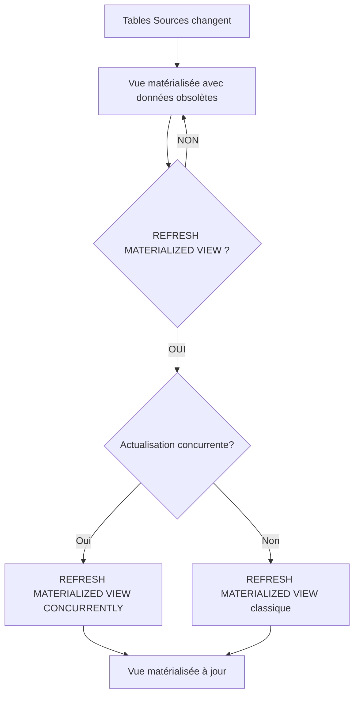

# Actualisation des vues matérialisées (Materialized Views)

Les vues matérialisées permettent de stocker physiquement les résultats d’une requête, ce qui améliore considérablement les performances de lecture sur des données complexes ou volumineuses. Cependant, ces données stockées ne sont pas automatiquement mises à jour lorsque les tables sources évoluent. L’**actualisation** (ou rafraîchissement) des vues matérialisées est donc une étape clé pour garantir la cohérence entre la vue et les données sous-jacentes.  

Cet article expose les principaux modes d’actualisation des vues matérialisées, avec leurs avantages, limites, et des exemples détaillés dans PostgreSQL.

---

## 1. Concepts d’actualisation d’une vue matérialisée  

- **Vue matérialisée** : résultat stocké d’une requête SQL.  
- **Actualisation** : opération qui réexécute la requête sous-jacente et met à jour les données stockées dans la vue matérialisée.  
- Sans actualisation, la vue restitue des données potentiellement obsolètes.

---

## 2. Modes d’actualisation  

### A. Actualisation complète (Full Refresh)

L’intégralité du contenu de la vue est recalculée à partir des tables sources.

```sql
REFRESH MATERIALIZED VIEW my_matview;
```

- **Avantages** : cohérence totale et simplicité.  
- **Inconvénients** : coûteux en ressources et temps quand les tables sources sont grandes.  

### B. Actualisation incrémentale (Fast Refresh)

- Permet de ne mettre à jour que les modifications (insertions, suppressions, modifications) depuis la dernière actualisation.  
- Supportée par certains SGBD comme Oracle avec des mécanismes de logs de changements et de dépendances.  
- **PostgreSQL** : ne supporte pas encore nativement le fast refresh, ce qui limite l’usage aux actualisations complètes.

---

## 3. Actualisation concurrente dans PostgreSQL  

Depuis PostgreSQL 9.4, il est possible d’actualiser une vue matérialisée **sans verrouiller la vue, donc sans interdire les lectures** pendant l’opération :  

```sql
REFRESH MATERIALIZED VIEW CONCURRENTLY my_matview;
```

**Conditions :**  
- La vue matérialisée doit avoir au moins une clé unique (unique index).  
- Cela crée une nouvelle version de la vue, permettant les lectures sur l’ancienne version le temps du rafraîchissement.

> Cet aspect est crucial dans un contexte de production pour limiter l’impact sur les utilisateurs.

---

## 4. Exemples d’utilisation  

### Création d’une vue matérialisée

```sql
CREATE MATERIALIZED VIEW sales_summary AS
SELECT product_id, SUM(amount) AS total_amount
FROM sales
GROUP BY product_id;
```

### Rafraîchissement simple (bloquant)

```sql
REFRESH MATERIALIZED VIEW sales_summary;
```

### Rafraîchissement concurrent

```sql
CREATE UNIQUE INDEX sales_summary_pid_idx ON sales_summary(product_id);

REFRESH MATERIALIZED VIEW CONCURRENTLY sales_summary;
```

---

## 5. Bonnes pratiques  

- Utiliser `CONCURRENTLY` pour minimiser l’impact sur les applications critiques.  
- Planifier périodiquement les actualisations en fonction de la criticité des données et de la volumétrie.  
- Analyser l'impact sur les performances avec `EXPLAIN ANALYZE` et surveiller la charge pendant le rafraîchissement.  
- Surveiller la présence d’index uniques nécessaires pour l’actualisation concurrente.  

---

## 6. Diagramme Mermaid : workflow d’actualisation  



---

## 7. Sources et références  

- [PostgreSQL Documentation - REFRESH MATERIALIZED VIEW](https://www.postgresql.org/docs/current/sql-refreshmaterializedview.html)  
- [PostgreSQL Wiki - Materialized Views Best Practices](https://wiki.postgresql.org/wiki/Materialized_Views)  
- [Oracle Documentation - Fast Refresh of Materialized Views](https://docs.oracle.com/en/database/oracle/oracle-database/19/dwhsg/materialized-views-and-snapshots.html#GUID-AD1DB1D1-70AB-4618-834D-748DFFBC8199)  
- [Cybertec Blog - PostgreSQL Materialized Views Overview](https://www.cybertec-postgresql.com/en/postgresql-materialized-views-explained/)  

---

## Conclusion  

L’actualisation des vues matérialisées est indispensable pour assurer l’intégrité des données affichées tout en tirant parti des performances offertes par ce mécanisme. PostgreSQL supporte une actualisation bloquante classique et, depuis la version 9.4, une actualisation concurrente pour garantir une disponibilité maximale pendant l’opération. Connaître ces modalités guide la conception des architectures SQL efficaces et adaptées aux contraintes métiers.