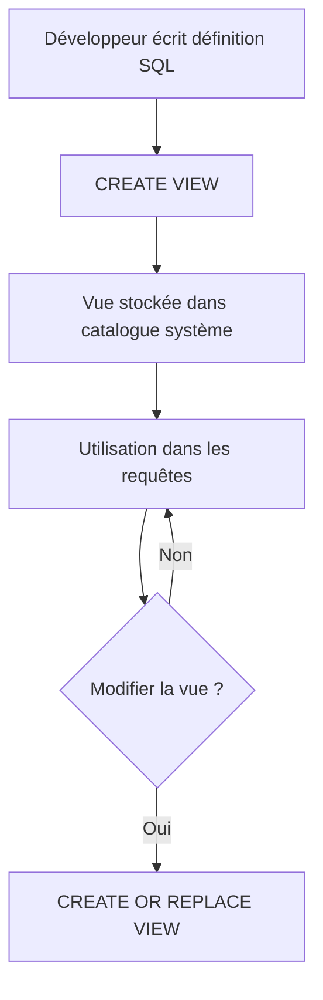

# Création et gestion des vues dans PostgreSQL : Syntaxe de création des vues

Les vues (**Views**) sont des objets SQL virtuels qui permettent de nommer et réutiliser une requête complexe, facilitant l’abstraction et la modularité des requêtes. PostgreSQL offre une syntaxe simple et puissante pour créer ces vues, avec plusieurs options pour adapter leur comportement aux besoins spécifiques.

Cet article expose la syntaxe de création des vues dans PostgreSQL, illustrée par des exemples concrets, et complète avec des conseils pratiques.

---

## 1. Syntaxe de création d’une vue

La commande principale pour créer une vue dans PostgreSQL est :

```sql
CREATE [ OR REPLACE ] VIEW nom_vue [ (colonne1, colonne2, ...) ] AS
  requête_sql
[ WITH [ CHECK OPTION | LOCAL CHECK OPTION | CASCADED CHECK OPTION ] ];
```

- `OR REPLACE` : permet de remplacer une vue existante sans avoir à la supprimer manuellement.  
- `[ (colonne1, colonne2, ...) ]` : liste optionnelle pour renommer ou définir explicitement les colonnes de la vue si la requête n’en fournit pas.  
- `WITH CHECK OPTION` : empêche l’insertion ou la mise à jour via la vue si la nouvelle ligne ne satisfait pas la condition de la vue (pertinent surtout pour les vues modifiables).

---

## 2. Exemples de création de vues

### Exemple simple sans renommage de colonnes

```sql
CREATE VIEW active_customers AS
SELECT customer_id, name, email
FROM customers
WHERE status = 'active';
```

Cette vue `active_customers` sélectionne les clients actifs et pourra être utilisée dans les requêtes comme une table.

---

### Exemple avec renommage explicite des colonnes

```sql
CREATE VIEW customer_summary (id, full_name) AS
SELECT customer_id, name
FROM customers;
```

Ici la vue possède des noms de colonnes personnalisés `id` et `full_name`.

---

### Exemple avec `OR REPLACE` pour mise à jour

```sql
CREATE OR REPLACE VIEW active_customers AS
SELECT customer_id, name, email, last_login
FROM customers
WHERE status = 'active';
```

Utile pour modifier la définition sans affecter les droits d’accès ou dépendances existantes.

---

### Exemple avec `WITH CHECK OPTION`

```sql
CREATE VIEW active_customers AS
SELECT customer_id, name, email
FROM customers
WHERE status = 'active'
WITH CHECK OPTION;
```

Cette option garantit que toute insertion/modification via cette vue respecte la condition `status = 'active'`.

---

## 3. Restrictions et spécificités dans PostgreSQL

- Les vues ne stockent pas de données elles-mêmes, elles sont recalculées à chaque requête.  
- Les vues modifiables peuvent être utilisées pour insérer, mettre à jour ou supprimer sous certaines conditions (absence de jointures complexes, agrégations, etc.).  
- Pour modifier la structure d’une vue (`ALTER VIEW`), PostgreSQL est limité, il est souvent plus simple d’utiliser `CREATE OR REPLACE VIEW`.  

---

## 4. Diagramme Mermaid : cycle de vie simple d’une vue



---

## 5. Sources  

- [PostgreSQL Documentation – CREATE VIEW](https://www.postgresql.org/docs/current/sql-createview.html)  
- [PostgreSQL Documentation – View Management](https://www.postgresql.org/docs/current/rules.html)  
- [Mode Analytics – SQL Views Tutorial](https://mode.com/sql-tutorial/sql-views/)  
- [SQLShack – Working with Views in PostgreSQL](https://www.sqlshack.com/working-with-views-in-postgresql/)  

---

## Conclusion  

La création des vues dans PostgreSQL repose sur une syntaxe claire et flexible qui permet de garder ses requêtes organisées, maintenables et parfois modifiables. La possibilité de remplacer une vue facilement et d’imposer des contraintes avec `WITH CHECK OPTION` renforce la gestion fine de ces objets virtuels. Savoir créer efficacement des vues aide à construire des bases de données relationnelles robustes et modulaires.