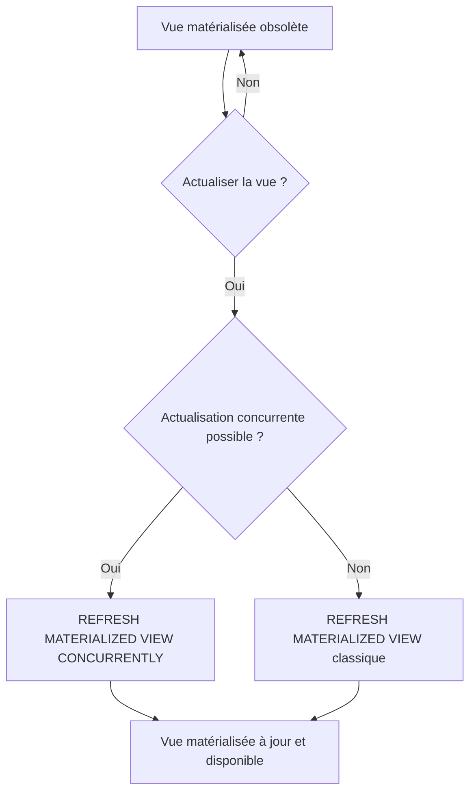

# Options d'actualisation des vues matérialisées dans PostgreSQL

Les vues matérialisées (Materialized Views) stockent physiquement les résultats d’une requête, offrant un gain significatif en termes de performances de lecture. Mais, pour rester pertinentes, elles doivent être régulièrement **actualisées** afin de refléter les modifications intervenues dans les tables sous-jacentes. PostgreSQL propose différentes options pour gérer cette actualisation. Cet article détaille ces options, illustre leur usage, et met en lumière leur impact.

---

## 1. Rappel : Qu’est-ce qu’une vue matérialisée ?

Une vue matérialisée est un objet SQL qui contient les résultats matérialisés d'une requête. Contrairement aux vues classiques, elle stocke les données sur disque, ce qui rend la lecture très rapide. Cependant, la vue devient obsolète au fur et à mesure que les données sources évoluent, d’où la nécessité d’une opération d’actualisation.

---

## 2. Syntaxe générale d’actualisation

```sql
REFRESH MATERIALIZED VIEW [ CONCURRENTLY ] nom_vue;
```

- `REFRESH MATERIALIZED VIEW` : commande qui met à jour la vue matérialisée en recalculant sa requête.  
- L’option `CONCURRENTLY` permet l’actualisation concurrente, offrant une disponibilité continue pendant la mise à jour.

---

## 3. Actualisation classique (bloquante)

```sql
REFRESH MATERIALIZED VIEW ma_vue_mat;
```

- Cette opération **verrouille la vue** pendant l’actualisation, ce qui empêche toute lecture ou écriture.  
- Le processus réexécute la requête et remplace entièrement les données.  
- Adéquat pour les scénarios où la récupération de données fraîche prime sur la disponibilité constante.  

---

## 4. Actualisation concurrente (non bloquante)

```sql
REFRESH MATERIALIZED VIEW CONCURRENTLY ma_vue_mat;
```

- Offre la possibilité de **lire la vue pendant son actualisation** grâce à la création d’une nouvelle version temporaire.  
- **Condition nécessaire** : la vue matérialisée doit posséder un **index unique**.  
- Très utile pour les environnements à haute disponibilité où des interruptions seraient problématiques.  

### Exemple de création d’un index unique requis

```sql
CREATE UNIQUE INDEX idx_ma_vue_mat_id ON ma_vue_mat(id);
```

---

## 5. Considérations importantes  

| Critère                | REFRESH classique          | REFRESH CONCURRENTLY       |
|------------------------|---------------------------|----------------------------|
| Blocage lecture/écriture| Oui                       | Non                        |
| Nécessite index unique | Non                       | Oui                        |
| Performance            | Plus rapide               | Plus lent à cause du mécanisme de lock fin et gestion des versions |
| Usage recommandé       | Données moins sensibles à la disponibilité | Systèmes en production sensibles |

---

## 6. Autres techniques d’actualisation  

- **Actualisation incrémentale** : actuellement non disponible nativement dans PostgreSQL, nécessite des extensions ou solutions personnalisées (ex : `pg_mv_refresh` ou logiques de triggers).  
- **Planification d’actualisation** : via des outils externes (cron, pgagent) pour automatiser les rafraîchissements à intervalle régulier.  

---

## 7. Exemple complet  

Création d’une vue matérialisée :

```sql
CREATE MATERIALIZED VIEW sales_summary AS
SELECT product_id, SUM(amount) AS total_sales
FROM sales
GROUP BY product_id;
```

Création d’un index unique nécessaire pour actualisation concurrente :

```sql
CREATE UNIQUE INDEX sales_summary_pid_idx ON sales_summary(product_id);
```

Actualisation concurrente :

```sql
REFRESH MATERIALIZED VIEW CONCURRENTLY sales_summary;
```

---

## 8. Diagramme mermaid : options d’actualisation



---

## 9. Sources et documentation  

- [PostgreSQL Documentation - REFRESH MATERIALIZED VIEW](https://www.postgresql.org/docs/current/sql-refreshmaterializedview.html)  
- [PostgreSQL Wiki - Materialized Views](https://wiki.postgresql.org/wiki/Materialized_Views)  
- [Cybertec PostgreSQL Blog - Materialized Views Best Practices](https://www.cybertec-postgresql.com/en/postgresql-materialized-views-explained/)  
- [Severalnines - Materialized Views in PostgreSQL](https://severalnines.com/blog/introduction-materialized-views-postgresql)  

---

## Conclusion

L’actualisation des vues matérialisées dans PostgreSQL se fait essentiellement via deux modes : classique (bloquant) et concurrent (non bloquant). Le choix dépend des contraintes métier entre fraîcheur des données et disponibilité continue. La connaissance de ces options permet d’optimiser la gestion des vues matérialisées et d’adapter leur actualisation aux environnements de production à forte charge.