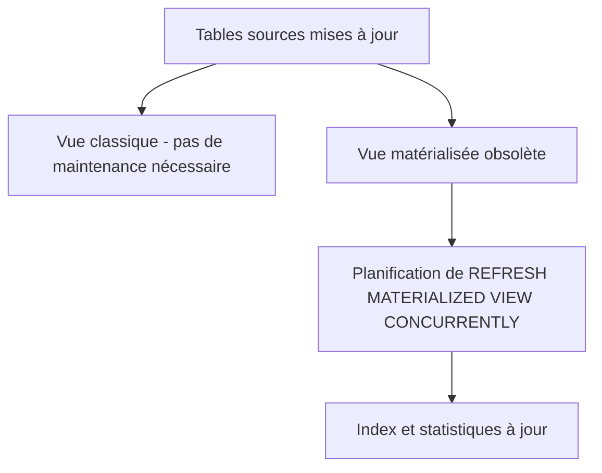

# Maintenance et optimisation des vues et vues matérialisées dans PostgreSQL

Les vues et vues matérialisées facilitent l’abstraction et la performance dans PostgreSQL, mais elles requièrent une maintenance régulière et une optimisation adaptée pour garantir efficacité et cohérence. Cet article présente les bonnes pratiques de maintenance, les leviers d’optimisation, ainsi que des exemples pratiques pour exploiter au mieux ces objets.

---

## 1. Maintenance des vues

### 1.1. Mise à jour des vues

- Les vues classiques sont des requêtes virtuelles : elles n’ont pas besoin d’être « mises à jour » car elles reflètent toujours l’état actuel des tables sources.  
- En revanche, si la structure des tables évolue (colonnes ajoutées, renommées), la vue peut devenir invalide et il faudra la recréer ou modifier via `CREATE OR REPLACE VIEW`.

### 1.2. Gestion des dépendances

- PostgreSQL gère les dépendances entre vues et tables. Une suppression d’une table référencée provoque une erreur si la vue n’est pas supprimée auparavant.  
- Pour visualiser les dépendances :

```sql
SELECT * FROM pg_depend WHERE refobjid = 'nom_vue'::regclass;
```

---

## 2. Maintenance des vues matérialisées

### 2.1. Rafraîchissement

- La principale opération de maintenance des vues matérialisées est leur **rafraîchissement** pour actualiser les données (`REFRESH MATERIALIZED VIEW`).  
- En fonction de l’usage, planifier des rafraîchissements réguliers à l’aide d’un job externe (ex: `pg_cron`) ou via triggers en cas de mise à jour.

### 2.2. Gestion des index

- Les vues matérialisées peuvent avoir des **index** pour accélérer les requêtes.  
- Après rafraîchissement, les index restent valides. Il est recommandé d’analyser la pertinence des indexes et de les reconstruire si nécessaire pour optimiser les performances.

### 2.3. Analyse et reindexation

- Exécuter périodiquement `ANALYZE` sur les vues matérialisées pour que l’optimiseur ait de bonnes statistiques.

```sql
ANALYZE nom_vue_mat;
```

- En cas de fragmentation, effectuer un `REINDEX`.

---

## 3. Optimisation des vues et vues matérialisées

### 3.1. Réduire la complexité des vues

- Limiter le nombre de jointures et d’agrégations dans une seule vue pour éviter des plans de requête lourds.  
- Découper la logique dans plusieurs vues intermédiaires si nécessaire.

### 3.2. Indexation stratégique

- Créer des index adaptés sur les colonnes fréquemment filtrées ou jointes dans les vues matérialisées.

```sql
CREATE INDEX idx_col1 ON nom_vue_mat(colonne1);
```

### 3.3. Rafraîchissement concurrent

- Utiliser `REFRESH MATERIALIZED VIEW CONCURRENTLY` pour éviter de bloquer l’accès à la vue pendant sa mise à jour (nécessite un index unique comme prérequis).

### 3.4. Limiter le champ des vues

- Ne sélectionner que les colonnes utiles dans la vue pour réduire la charge mémoire et disque.  
- Exclure les colonnes volumineuses non utilisées.

---

## 4. Exemple de stratégie de maintenance



---

## 5. Sources et références

- [PostgreSQL Documentation - Views](https://www.postgresql.org/docs/current/sql-createview.html)  
- [PostgreSQL Documentation - Materialized Views](https://www.postgresql.org/docs/current/sql-creatematerializedview.html)  
- [PostgreSQL Wiki - Materialized Views](https://wiki.postgresql.org/wiki/Materialized_Views)  
- [Cybertec PostgreSQL Blog - Performance Tips](https://www.cybertec-postgresql.com/en/postgresql-performance-tips-and-tricks/)  

---

## Conclusion

Assurer la maintenance régulière des vues et vues matérialisées permet de préserver la cohérence et la performance dans PostgreSQL. Le rafraîchissement adapté des vues matérialisées, la gestion efficace des index, et la simplification des vues contribuent à un système plus robuste et performant. Une stratégie de maintenance bien définie et des optimisations ciblées maximisent le bénéfice apporté par ces outils.