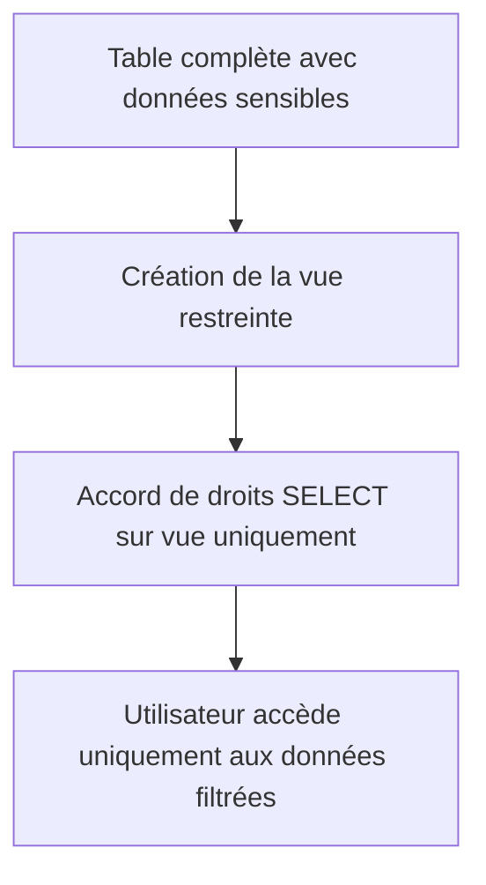

# Sécurisation des données via les vues dans PostgreSQL

Les vues dans PostgreSQL sont un outil puissant non seulement pour simplifier les requêtes, mais aussi pour **sécuriser l'accès aux données sensibles**. En restreignant l’exposition des colonnes ou lignes, les vues permettent de contrôler précisément ce que les utilisateurs peuvent consulter ou modifier.

Cet article présente comment utiliser les vues pour sécuriser les données, illustre avec des exemples pratiques, et détaille les mécanismes associés.

---

## 1. Pourquoi sécuriser via des vues ?

- Masquer les colonnes sensibles (ex: mots de passe, salaires).  
- Restreindre l’accès à un sous-ensemble des lignes (ex: données par département).  
- Fournir une interface simplifiée sans exposer la complexité des tables.  
- Coupler avec la gestion des droits pour un modèle de sécurité renforcé.

---

## 2. Création d’une vue sécurisée

### Exemple simple de restriction colonnes

Supposons une table `employes` :

```sql
CREATE TABLE employes (
  id SERIAL PRIMARY KEY,
  nom VARCHAR(100),
  salaire NUMERIC,
  email VARCHAR(100)
);
```

Créons une vue qui cache la colonne `salaire` pour certains utilisateurs :

```sql
CREATE VIEW employes_public AS
SELECT id, nom, email
FROM employes;
```

### Gestion des privilèges sur la vue

- Les utilisateurs se voient accorder uniquement le droit de SELECT sur la vue, pas sur la table directe.

```sql
REVOKE ALL ON employes FROM public;
GRANT SELECT ON employes_public TO analystes;
```

---

## 3. Filtrage des lignes via les vues

Vous pouvez restreindre les lignes visibles en ajoutant des conditions dans la vue.

Exemple : limiter les données aux employés du département ‘Marketing’ (supposons une colonne `departement` dans la table) :

```sql
CREATE VIEW employes_marketing AS
SELECT id, nom, email
FROM employes
WHERE departement = 'Marketing';
```

---

## 4. Sécurisation avancée : Vues avec `WITH CHECK OPTION`

Cette option empêche les utilisateurs de modifier ou insérer des données via une vue qui ne respecteraient pas la condition définie.

```sql
CREATE VIEW employes_active AS
SELECT id, nom, email
FROM employes
WHERE actif = TRUE
WITH CHECK OPTION;
```

Ainsi, les mises à jour ou insertions via la vue ne peuvent pas faire basculer un employé dans un état `actif = FALSE`.

---

## 5. Exemple complet avec droits

```sql
CREATE TABLE employes (
  id SERIAL PRIMARY KEY,
  nom VARCHAR(100),
  salaire NUMERIC,
  email VARCHAR(100),
  departement VARCHAR(50),
  actif BOOLEAN DEFAULT TRUE
);

CREATE VIEW employes_publ AS
SELECT id, nom, email
FROM employes
WHERE actif = TRUE
WITH CHECK OPTION;

REVOKE ALL ON employes FROM public;

GRANT SELECT ON employes_publ TO equipe_support;
GRANT SELECT, UPDATE ON employes_publ TO manager;
```

---

## 6. Limitations et bonnes pratiques

- Une vue n’empêche pas un utilisateur avec un accès super-utilisateur (ex: `postgres`) d’accéder directement aux tables.  
- Toujours **accorder les privilèges avec parcimonie** : révoquer l’accès aux tables, ne concéder que les droits nécessaires sur les vues.  
- Coupler ce contrôle avec d’autres mécanismes SQL (RLS - Row Level Security) pour une granularité renforcée.

---

## 7. Diagramme Mermaid : sécurisation via vue



---

## 8. Sources et références

- [PostgreSQL Documentation - VIEWS](https://www.postgresql.org/docs/current/sql-createview.html)  
- [PostgreSQL Documentation - GRANT](https://www.postgresql.org/docs/current/sql-grant.html)  
- [PostgreSQL Documentation - WITH CHECK OPTION](https://www.postgresql.org/docs/current/sql-createview.html#SQL-CREATEVIEW-WITH-CHECK)  
- [PostgreSQL Row Level Security](https://www.postgresql.org/docs/current/ddl-rowsecurity.html)  
- [Cybertec Blog - Security by Views](https://www.cybertec-postgresql.com/en/postgresql-security-row-level-security-views/)  

---

## Conclusion  

Les vues permettent de mettre en place un premier niveau de **sécurisation fonctionnelle** des données en limitant colonnes et lignes accessibles. En combinant ces vues avec une gestion fine des privilèges et des options comme `WITH CHECK OPTION`, PostgreSQL offre une solution flexible et efficace pour répondre à différents besoins de confidentialité au sein d’une même base de données.