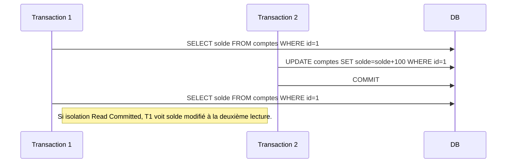

# Transactions et concurrence en PostgreSQL : Principes fondamentaux

La gestion des transactions est au cœur des systèmes de bases de données relationnelles comme PostgreSQL. Elle garantit la cohérence, la fiabilité et l’intégrité des données, même en cas de pannes ou d’exécutions simultanées. Cet article présente la définition d’une transaction, le modèle ACID qui en formalise la robustesse, ainsi que les différents niveaux d’isolation permettant de contrôler la concurrence.

---

## 1. Qu’est-ce qu’une transaction ?

Une **transaction** est un ensemble d'opérations SQL qui sont exécutées de manière atomique, cohérente, isolée et durable. Cela signifie que les modifications apportées par la transaction sont toutes prises en compte **ou aucune**, ce qui garantit la cohérence des données.

### Début, validation et annulation d’une transaction :

```sql
BEGIN;                            -- Démarrage de la transaction
UPDATE comptes SET solde = solde - 100 WHERE id = 1;
UPDATE comptes SET solde = solde + 100 WHERE id = 2;
COMMIT;                           -- Validation définitive

-- Ou en cas de problème

ROLLBACK;                        -- Annulation de la transaction
```

---

## 2. Propriétés ACID

Les transactions en bases de données respectent quatre propriétés fondamentales dites **ACID** :  

| Propriété     | Description                                                    |
|---------------|----------------------------------------------------------------|
| **Atomicité** | La transaction est indivisible : tout ou rien.                |
| **Cohérence** | La base reste dans un état valide avant et après la transaction.|
| **Isolation** | Les effets d’une transaction sont invisibles pour les autres jusqu’à sa validation.|
| **Durabilité**| Une fois validée, la transaction est permanente même en cas de panne.|

Ces propriétés assurent qu’en situation de forte concurrence ou d’incident technique, les données restent fiables.

---

## 3. Niveaux d’isolation des transactions dans PostgreSQL

L’isolation définit comment et quand les modifications d’une transaction sont visibles aux autres transactions. Quatre niveaux d’isolation sont définis dans la norme SQL et supportés par PostgreSQL :  

| Niveau             | Description                                                | Anomalies possibles               |
|--------------------|------------------------------------------------------------|---------------------------------|
| **Read Uncommitted**| Lecture même des données non validées (lecture sale).     | *Dirty reads*, *non repeatable reads*, *phantoms* |
| **Read Committed**  | Lecture des données validées uniquement (par défaut).      | *Non repeatable reads*, *phantoms* |
| **Repeatable Read** | Lecture constante durant la transaction, pas de *non repeatable reads* mais *phantoms* possibles. | *Phantom reads*                |
| **Serializable**    | Niveau le plus strict, simule une exécution séquentielle. | Aucune anomalie, mais plus couteux |

### Exemple : changer le niveau d’isolation à Repeatable Read

```sql
BEGIN TRANSACTION ISOLATION LEVEL REPEATABLE READ;
SELECT * FROM comptes WHERE id = 1;
-- Opérations
COMMIT;
```

---

## 4. Illustration des anomalies de lecture



- **Non repeatable read** : une requête répétée au sein d’une même transaction renvoie des résultats différents.  
- **Phantom read** : apparition ou disparition de lignes lors d’une même transaction.

---

## 5. Modèle MVCC de PostgreSQL

PostgreSQL utilise un modèle **Multi-Version Concurrency Control (MVCC)** qui maintient plusieurs versions des lignes pour permettre des lectures sans blocage. Il assure un bon compromis entre performance et isolation.

- Les lectures ne bloquent pas les écritures et inversement.  
- Chaque transaction voit une "photo" cohérente des données à son démarrage.

---

## 6. Résumé Mermeid sur ACID et isolation

```mermaid
graph TD
  A[Transaction] --> B[Atomicité]
  A --> C[Cohérence]
  A --> D[Isolation]
  A --> E[Durabilité]
  
  D --> F[Read Uncommitted]
  D --> G[Read Committed (par défaut)]
  D --> H[Repeatable Read]
  D --> I[Serializable]
```

---

## 7. Sources et références

- [PostgreSQL Documentation - Transactions](https://www.postgresql.org/docs/current/tutorial-transactions.html)  
- [PostgreSQL Documentation - MVCC](https://www.postgresql.org/docs/current/mvcc-intro.html)  
- [PostgreSQL Documentation - Isolation Levels](https://www.postgresql.org/docs/current/transaction-iso.html)  
- [Oracle: ACID Properties](https://docs.oracle.com/cd/B19306_01/server.102/b14220/consist.htm)  
- [IBM - Understanding Database Transactions](https://www.ibm.com/docs/en/db2/11.5?topic=applications-understanding-database-transactions)  

---

## Conclusion

Les transactions appliquent dans PostgreSQL les propriétés ACID qui assurent intégrité et fiabilité des données. Le niveau d’isolation permet de choisir le compromis entre concurrence et cohérence. Le modèle MVCC de PostgreSQL optimise la gestion concurrente pour fournir à la fois performance et conformité aux règles transactionnelles. Comprendre ces principes aide à concevoir et optimiser des applications robustes.