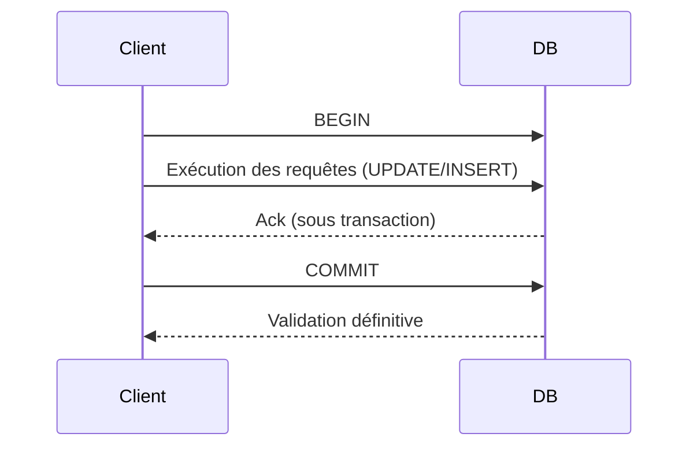

# Exemples concrets d'utilisation des transactions en PostgreSQL

Les transactions sont un pilier fondamental dans la gestion fiable et cohérente des données en base. Comprendre concrètement comment les mettre en œuvre dans des cas d'usage réels permet de maîtriser la gestion des erreurs, la concurrence, et la cohérence des données. Cet article illustre plusieurs scénarios typiques d’utilisation des transactions dans PostgreSQL, accompagnés d’exemples SQL et de pratiques recommandées.

---

## 1. Transfert d'argent entre comptes (transaction atomique)

Classique et significatif : le transfert d’argent entre deux comptes bancaires doit être **atomique** (succès total ou annulation totale).

```sql
BEGIN;
UPDATE comptes SET solde = solde - 500 WHERE id = 1;  -- Débiter compte 1
UPDATE comptes SET solde = solde + 500 WHERE id = 2;  -- Créditer compte 2
COMMIT;
```

- Si une erreur survient (ex: solde insuffisant), un `ROLLBACK;` permet d’annuler entièrement la transaction.  
- L’isolation empêche une lecture partielle des modifications avant validation.

---

## 2. Insertion de commande avec validation des stocks

Imaginons que l’on crée une commande uniquement si le stock est suffisant, pour éviter les incohérences.

```sql
BEGIN;

-- Vérifier le stock
SELECT quantity FROM stock WHERE product_id = 123 FOR UPDATE;

-- Si quantité suffisante, continuer
UPDATE stock SET quantity = quantity - 2 WHERE product_id = 123;
INSERT INTO commandes (product_id, quantity, client_id) VALUES (123, 2, 45);

COMMIT;
```

- Le verrouillage `FOR UPDATE` empêche une autre transaction de modifier la quantité simultanément.  
- Evite la sur-vente grâce à une lecture verrouillée.

---

## 3. Détection et gestion des conflits en concurrence

PostgreSQL gère la concurrence via MVCC. Parfois, un conflit de mise à jour nécessite une gestion explicite.

### Exemple d’erreur de concurrence et retry

```plpgsql
DO $$
DECLARE
  retries INT := 3;
BEGIN
  PERFORM pg_sleep(0.1); -- petite pause arbitrée
  WHILE retries > 0 LOOP
    BEGIN
      BEGIN TRANSACTION ISOLATION LEVEL SERIALIZABLE;
      -- Opérations critiques
      COMMIT;
      EXIT;
    EXCEPTION WHEN serialization_failure THEN
      retries := retries - 1;
      RAISE NOTICE 'Retrying transaction, remaining: %', retries;
    END;
  END LOOP;

  IF retries = 0 THEN
    RAISE EXCEPTION 'Transaction failed after retries';
  END IF;
END;
$$;
```

- Niveau d’isolation `SERIALIZABLE` peut générer des erreurs `serialization_failure` si les transactions sont en conflit.  
- Stratégie retry recommandée pour garantir la réussite.

---

## 4. Regroupement de modifications (batch) pour performances

Pour optimiser les performances, il est recommandé de grouper plusieurs opérations dans une même transaction.

```sql
BEGIN;

INSERT INTO logs VALUES (...);
UPDATE comptes SET last_activity = NOW() WHERE id = 1;
DELETE FROM sessions WHERE expiry < NOW();

COMMIT;
```

Cela réduit le coût des validations successives et assure cohérence globale.

---

## 5. Diagramme Mermaid : cycle simplifié d'une transaction



---

## 6. Bonnes pratiques à retenir

- Toujours utiliser `BEGIN`...`COMMIT` ou des blocs transactionnels pour garantir atomicité.  
- Préférer les niveaux d’isolation adaptés selon les besoins métier (ex: `READ COMMITTED` pour performance, `SERIALIZABLE` pour cohérence stricte).  
- Gérer les exceptions de concurrence (retries sur conflits).  
- Limiter le scope de la transaction pour réduire les risques de blocages prolongés.

---

## 7. Sources et références

- [PostgreSQL Documentation - Transactions and Concurrency](https://www.postgresql.org/docs/current/tutorial-transactions.html)  
- [PostgreSQL Documentation - Locking](https://www.postgresql.org/docs/current/explicit-locking.html)  
- [PostgreSQL Documentation - Serialization Failures and Retry](https://www.postgresql.org/docs/current/mvcc.html#MVCC-CONFLICTS)  
- [DigitalOcean - Handling Concurrency in PostgreSQL](https://www.digitalocean.com/community/tutorials/postgresql-concurrency-control)  

---

## Conclusion

Les transactions sont à la fois simples à utiliser et essentielles pour garantir fiabilité et cohérence dans des environnements concurrents. Comprendre les mécanismes de base à travers des exemples concrets facilite l’implémentation de traitements robustes en PostgreSQL, du transfert bancaire à la gestion de stock, en passant par la résolution intelligente des conflits.