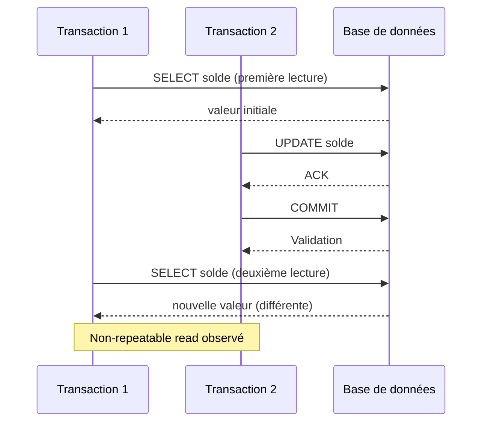

# Phénomènes de concurrence en base de données : Dirty Read, Non-Repeatable Read, Phantom Read

La gestion de la concurrence des transactions est indispensable pour maintenir la cohérence des données dans un système multi-utilisateurs. Cependant, en fonction du niveau d'isolation choisi, certaines **anomalies de lecture** peuvent apparaître, perturbant la fiabilité des données consultées. Cet article présente les trois phénomènes de concurrence majeurs : **dirty read**, **non-repeatable read** et **phantom read**, avec des exemples et illustrations concrètes.

---

## 1. Dirty Read (lecture sale)

### Définition

Un **dirty read** survient lorsqu’une transaction lit des données modifiées par une autre transaction non encore validée (non commitée). Si cette dernière est annulée (`ROLLBACK`), la première a vu une donnée non permanente, donc invalide.

### Exemple

Transaction T1 modifie un enregistrement, mais ne valide pas :

```sql
-- T1
BEGIN;
UPDATE comptes SET solde = 1000 WHERE id=1;
-- T1 n'a pas fait COMMIT
```

Transaction T2 lit ce solde modifié avant validation :

```sql
-- T2
BEGIN;
SELECT solde FROM comptes WHERE id=1;  -- lit la valeur temporaire 1000
COMMIT;
```

Si T1 fait finalement `ROLLBACK;`, T2 aura lu une donnée inconsistante.

### PostgreSQL et dirty reads

PostgreSQL **n’autorise pas** le dirty read en niveau d'isolation `READ COMMITTED` et supérieur. Le niveau `READ UNCOMMITTED` est un alias de `READ COMMITTED` dans PostgreSQL, donc le dirty read n’est jamais observable.

---

## 2. Non-repeatable Read (lecture non répétable)

### Définition

Une transaction lit plusieurs fois la même donnée, mais entre les deux lectures, une autre transaction la modifie et valide. La première transaction obtient donc des valeurs différentes.

### Exemple

Transaction T1 :

```sql
BEGIN;
SELECT solde FROM comptes WHERE id=1;  -- renvoie 500
```

Transaction T2 :

```sql
BEGIN;
UPDATE comptes SET solde = 700 WHERE id=1;
COMMIT;
```

Retour à T1 :

```sql
SELECT solde FROM comptes WHERE id=1;  -- renvoie 700, différent de la première lecture
COMMIT;
```

---

## 3. Phantom Read (lecture fantôme)

### Définition

Une **phantom read** se produit lorsqu’une transaction lit un ensemble de lignes qui satisfait une condition, mais une autre transaction insère ou supprime des lignes qui modifient cet ensemble, entraînant une différence au fil des lectures.

### Exemple

Transaction T1 :

```sql
BEGIN;
SELECT * FROM commandes WHERE montant > 1000;  -- 5 lignes retournées
```

Transaction T2 :

```sql
BEGIN;
INSERT INTO commandes (id, montant) VALUES (1001, 1500);
COMMIT;
```

Retour à T1 :

```sql
SELECT * FROM commandes WHERE montant > 1000;  -- 6 lignes retournées, apparition du "phantom"
COMMIT;
```

---

## 4. Carte synthétique des anomalies et niveaux d'isolation

| Niveau d'isolation        | Dirty Read | Non-repeatable Read | Phantom Read |
|---------------------------|------------|---------------------|--------------|
| READ UNCOMMITTED          | Possible   | Possible            | Possible     |
| READ COMMITTED (défaut PostgreSQL) | Impossible | Possible            | Possible     |
| REPEATABLE READ           | Impossible | Impossible          | Possible     |
| SERIALIZABLE              | Impossible | Impossible          | Impossible   |

---

## 5. Diagramme Mermaid : Cycle des phénomènes



---

## 6. Gestion des lectures dans PostgreSQL

- PostgreSQL utilise un modèle **MVCC** (Multi-Version Concurrency Control) qui garantit que chaque transaction voit une version cohérente des données basée sur son point de départ.  
- Par défaut, le niveau `READ COMMITTED` évite les dirty reads.  
- Le niveau `REPEATABLE READ` évite les non-repeatable reads mais pas totalement les phantoms.  
- Le niveau `SERIALIZABLE` assure une isolation stricte empêchant toutes ces anomalies.

---

## 7. Sources et références

- [PostgreSQL Documentation - Transaction Isolation](https://www.postgresql.org/docs/current/transaction-iso.html)  
- [Oracle Documentation - Concurrency Phenomena](https://docs.oracle.com/cd/B19306_01/server.102/b14220/consist.htm)  
- [IBM - Database Read Phenomena](https://www.ibm.com/docs/en/db2/11.5?topic=transactions-read-phenomena)  
- [Microsoft Docs - Isolation Levels](https://learn.microsoft.com/en-us/sql/t-sql/statements/set-transaction-isolation-level-transact-sql)  
- [DigitalOcean - Isolation Levels and Phenomena](https://www.digitalocean.com/community/tutorials/understanding-isolation-levels-in-postgresql)  

---

## Conclusion

La compréhension des phénomènes de concurrence comme dirty read, non-repeatable read et phantom read est indispensable pour choisir le niveau d’isolation adapté aux besoins de l’application. PostgreSQL propose un excellent compromis via son modèle MVCC et ses niveaux d’isolation, protégeant efficacement contre ces anomalies classiques tout en maintenant une bonne performance.