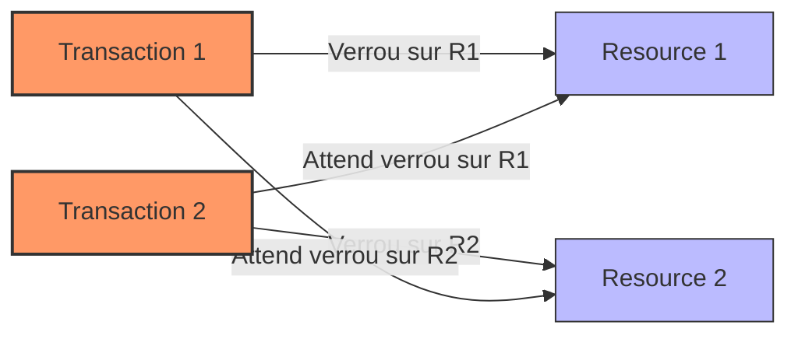

# Deadlocks et stratégies de résolution dans les transactions PostgreSQL

La gestion de la concurrence dans les bases de données relationnelles peut conduire à des situations bloquantes appelées **deadlocks** (interblocages), où deux ou plusieurs transactions attendent indéfiniment des ressources détenues les unes par les autres. Comprendre la genèse des deadlocks et disposer de stratégies efficaces pour les détecter et les résoudre est fondamental pour assurer la disponibilité et la réactivité des systèmes.

---

## 1. Qu’est-ce qu’un deadlock ?

Un deadlock survient lorsqu’un cycle d’attente de ressources empêche toute progression des transactions impliquées. Par exemple :

- Transaction T1 détient un verrou sur la ressource R1 et attend un verrou sur R2  
- Transaction T2 détient un verrou sur R2 et attend un verrou sur R1  

Aucune des deux ne peut avancer, la situation est bloquée.

---

## 2. Exemple simple de deadlock dans PostgreSQL

```sql
-- Transaction T1
BEGIN;
UPDATE comptes SET solde = solde - 100 WHERE id = 1;

-- Transaction T2
BEGIN;
UPDATE comptes SET solde = solde + 100 WHERE id = 2;

-- T1 tente de mettre à jour id=2
UPDATE comptes SET solde = solde + 100 WHERE id = 2;  -- blocage si T2 bloque cette ligne

-- T2 tente de mettre à jour id=1
UPDATE comptes SET solde = solde - 100 WHERE id = 1;  -- blocage croisé, deadlock
```

Ces mises à jour croisées peuvent entraîner un deadlock.

---

## 3. Détection et résolution automatique par PostgreSQL

PostgreSQL possède un détecteur de deadlocks qui surveille les verrous. Lorsqu’un deadlock est détecté, la base :

- Choisit une transaction victime (souvent la plus récente ou avec le moins de travail fait)  
- Abandonne cette transaction en générant une erreur `ERROR: deadlock detected`  
- Permet aux autres transactions de poursuivre

L’application doit alors gérer cette erreur afin de relancer ou annuler proprement la transaction.

---

## 4. Stratégies pour éviter ou minimiser les deadlocks

### 4.1. Acquisition ordonnée des verrous

Toujours verrouiller les ressources dans le même ordre dans toutes les transactions.

### 4.2. Transactions courtes

Limiter la durée des transactions réduit la fenêtre de contention.

### 4.3. Verrouillage explicite anticipé

Utiliser `SELECT ... FOR UPDATE` ou `LOCK TABLE` pour verrouiller explicitement afin d’éviter les surprenants blocages.

### 4.4. Gestion côté application

Détecter l’erreur de deadlock et relancer la transaction de façon sécurisée (retry avec backoff).

```plpgsql
-- Exemple simplifié en PL/pgSQL
BEGIN
  -- code transactionnel
EXCEPTION WHEN deadlock_detected THEN
  PERFORM pg_sleep(random() * 0.5);
  RAISE;
END;
```

---

## 5. Diagramme Mermaid : cycle de deadlock



---

## 6. Monitoring et diagnostic

- Loguer les erreurs de deadlock en configurant `log_lock_waits` et `deadlock_timeout` dans `postgresql.conf`  
- Utiliser les vues système comme `pg_locks` pour analyser les blocages en cours  
- Outils tiers et extensions PostgreSQL (ex: pgBadger) fournissent des rapports utiles  

---

## 7. Sources

- [PostgreSQL Documentation - Locking and Deadlocks](https://www.postgresql.org/docs/current/explicit-locking.html#LOCKING-DEADLOCKS)  
- [PostgreSQL Wiki - Concurrency Control](https://wiki.postgresql.org/wiki/Concurrency_Control)  
- [Cybertec PostgreSQL - Deadlock Detection and Avoidance](https://www.cybertec-postgresql.com/en/postgresql-deadlock-detection-and-avoidance/)  
- [Postgres Guide - Deadlock Understanding](https://www.postgresguide.com/admin/deadlocks/)  

---

## Conclusion

Les deadlocks sont des phénomènes inévitables dans les systèmes concurrents, mais leur impact peut être limité par une bonne conception des transactions, une gestion ordonnée des verrous, et une détection automatique fiable intégrée à PostgreSQL. Une gestion adaptée des erreurs et un monitoring efficace permettent de maintenir la fluidité et la cohérence de vos applications.