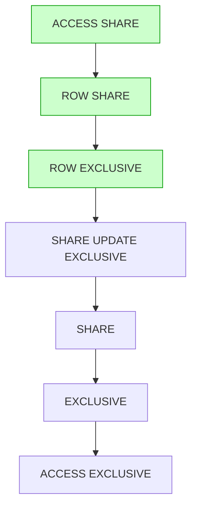

# Types de verrous dans PostgreSQL : Comprendre la gestion fine de la concurrence

PostgreSQL met en œuvre un système puissant de gestion des verrous (locks) permettant d'assurer la cohérence et l'intégrité des données en environnement multi-utilisateurs. La connaissance des différents types de verrous est indispensable pour analyser les performances, résoudre les blocages et optimiser les transactions.

---

## 1. Pourquoi des verrous ?

Les verrous sont utilisés pour contrôler l’accès concurrent aux ressources (lignes, tables, objets) afin d’éviter les conflits et garantir les propriétés ACID. PostgreSQL combine son système MVCC avec des verrous explicites pour gérer efficacement les accès concurrents.

---

## 2. Types de verrous et leur granularité

PostgreSQL distingue plusieurs types de verrous selon la granularité et le mode d’accès :

| Type de verrou               | Niveau d’application | Description                                                  |
|-----------------------------|----------------------|--------------------------------------------------------------|
| **Row-Level Locks**          | Ligne (tuple)         | Verrouillent des lignes spécifiques pour UPDATE, DELETE     |
| **Table-Level Locks**        | Table                 | Contrôle les accès concurrentiels aux tables                 |
| **Advisory Locks**           | Application           | Locks personnalisés, indépendants des transactions           |
| **Predicate Locks**          | Range de données      | Utilisés en isolation SERIALIZABLE (via Serializable Snapshot Isolation - SSI) pour éviter anomalies *phantom* |

---

## 3. Verrous au niveau des lignes (Row-Level Locks)

### 3.1. Verrou **FOR UPDATE**

Verrouille une ou plusieurs lignes sélectionnées pour un usage exclusif – empêche d’autres transactions de les modifier jusqu’au commit ou rollback.

```sql
BEGIN;
SELECT * FROM comptes WHERE id = 1 FOR UPDATE;
UPDATE comptes SET solde = solde - 100 WHERE id = 1;
COMMIT;
```

### 3.2. Autres variantes

- `FOR NO KEY UPDATE` : moins restrictif que `FOR UPDATE`, bloque seulement certains changements.
- `FOR SHARE` : verrou de lecture partagé utilisé pour protéger la ligne d’écritures concurrentes.  
- `FOR KEY SHARE` : verrou moins restrictif que `FOR SHARE`, protège les clés référencées.

---

## 4. Verrous au niveau de la table (Table Locks)

PostgreSQL gère plusieurs modes de verrous table, depuis la lecture jusqu'à l’exclusion totale.

| Mode                    | Effet                                              | Exemple d’utilisation                   |
|-------------------------|---------------------------------------------------|----------------------------------------|
| ACCESS SHARE            | Lecture simple, compatible avec toutes lectures   | `SELECT * FROM table`                   |
| ROW SHARE               | Verrous acquis par `SELECT FOR UPDATE`            | Sorit pour UPDATE sur des lignes        |
| ROW EXCLUSIVE           | Verrou utilisé par opérations UPDATE, INSERT, DELETE | Modifications simples                  |
| SHARE UPDATE EXCLUSIVE  | Pour certaines opérations spécifiques              | VACUUM non FULL                        |
| SHARE                   | Empêche l’écriture, compatible avec lecture       | Ex: commandes explicites lock table    |
| EXCLUSIVE               | Empêche presque tous types d’accès                  | DDL légères                          |
| ACCESS EXCLUSIVE        | Verrou le plus strict, bloque toute lecture et écriture | Opérations DDL lourdes (DROP TABLE)    |

**Exemple de verrou explicite sur table :**

```sql
LOCK TABLE comptes IN EXCLUSIVE MODE;
```

---

## 5. Verrous conseils (Advisory Locks)

PostgreSQL propose des **advisory locks**, des verrous applicatifs que le développeur peut manipuler explicitement indépendamment des transactions.

```sql
SELECT pg_advisory_lock(12345);   -- acquiert un lock
SELECT pg_advisory_unlock(12345); -- libère le lock
```

Utiles pour synchroniser des opérations métier complexes.

---

## 6. Diagramme Mermaid : hiérarchie et compatibilités des verrous table-level



---

## 7. Monitoring des verrous

Les vues système suivantes aident à analyser l’état des verrous dans PostgreSQL :

- `pg_locks` : liste des verrous en cours, leurs modes et objets verrouillés  
- `pg_stat_activity` : informations sur les sessions et requêtes en cours

```sql
SELECT pid, locktype, mode, relation::regclass, granted
FROM pg_locks
WHERE NOT granted;  -- verrous en attente
```

---

## 8. Sources et références

- [PostgreSQL Documentation - Explicit Locking](https://www.postgresql.org/docs/current/explicit-locking.html)  
- [PostgreSQL Documentation - Advisory Locks](https://www.postgresql.org/docs/current/explicit-locking.html#ADVISORY-LOCKS)  
- [Cybertec PostgreSQL - Locking Explained](https://www.cybertec-postgresql.com/en/locking-explained-in-postgresql/)  
- [SeveralNines - PostgreSQL Locking Basics](https://severalnines.com/database-blog/postgresql-locking-basics-understanding-waits-blocks)  

---

## Conclusion

Les verrous dans PostgreSQL sont multiples et fins, couvrant du verrouillage au niveau ligne jusqu’aux verrous exclusifs sur tables et aux verrous conseils. Combiner une bonne compréhension des types de verrous avec une supervision active permet d’éviter blocages, améliorer la concurrence et garantir l’intégrité des données dans des environnements de production exigeants.