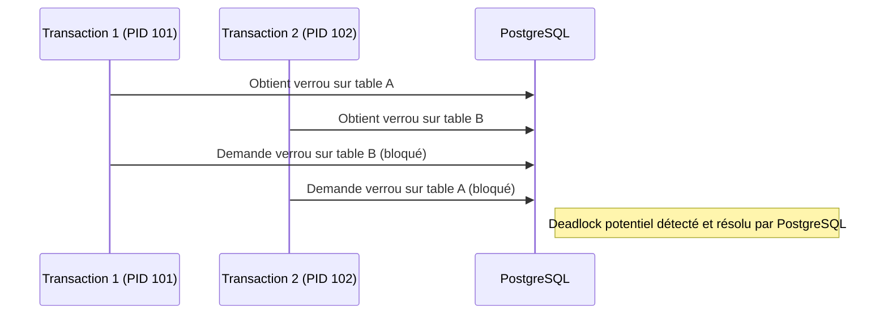

# Monitoring des blocages dans PostgreSQL : commandes et vues essentielles

Dans un environnement PostgreSQL multi-utilisateur, les blocages (locks) peuvent impacter significativement les performances et la disponibilité. Savoir détecter et diagnostiquer ces blocages est indispensable pour assurer un fonctionnement fluide. Cet article présente les commandes et vues système clés pour monitorer les verrous et analyser les blocages dans PostgreSQL.

---

## 1. Vue système `pg_locks` : état des verrouillages

La vue `pg_locks` fournit un instantané des verrous détenus et demandés par les transactions en cours.

### Principaux champs utiles

| Colonne         | Description                                  |
|-----------------|----------------------------------------------|
| `pid`           | Identifiant de la session qui détient le lock|
| `locktype`      | Type de verrou (relation, tuple, transaction, ...) |
| `relation`      | Identifiant de la table verrouillée (si applicable) |
| `mode`          | Mode de verrou (ex. `RowExclusiveLock`)     |
| `granted`       | Indique si le verrou est détenu (`true`) ou en attente (`false`) |

### Exemple de recherche de verrous non accordés (attente)

```sql
SELECT pid, locktype, mode, relation::regclass, granted
FROM pg_locks 
WHERE NOT granted;
```

Cette requête liste les sessions bloquées en attente de verrou.

---

## 2. Vue `pg_stat_activity` : informations sur les connexions actives

Pour mieux comprendre l’origine des blocages, il est utile de joindre `pg_locks` à la vue `pg_stat_activity`, qui expose les requêtes en cours, l'état des connexions, et les utilisateurs.

```sql
SELECT a.pid, a.usename, a.query, l.locktype, l.mode, l.granted
FROM pg_stat_activity a
JOIN pg_locks l ON a.pid = l.pid
WHERE NOT l.granted;
```

---

## 3. Recherche des relations bloquantes et bloquées

PostgreSQL ne fournit pas directement une vue "bloqueurs et bloqués", mais la jointure `pg_locks` permet d’isoler ces relations.

### Exemple complet pour lister les blocages et bloqués

```sql
WITH blocked_locks AS (
  SELECT pid, locktype, relation, mode
  FROM pg_locks
  WHERE NOT granted
),
blocking_locks AS (
  SELECT pid, locktype, relation, mode
  FROM pg_locks
  WHERE granted
)
SELECT bl.pid AS blocked_pid,
       a.query AS blocked_query,
       kl.pid AS blocking_pid,
       ka.query AS blocking_query,
       bl.mode AS blocked_mode,
       kl.mode AS blocking_mode
FROM blocked_locks bl
JOIN blocking_locks kl ON bl.locktype = kl.locktype AND bl.relation = kl.relation
JOIN pg_stat_activity a ON a.pid = bl.pid
JOIN pg_stat_activity ka ON ka.pid = kl.pid;
```

Cette requête met en relation les sessions bloquées avec leurs bloqueurs, facilitant le diagnostic.

---

## 4. Commandes d’état et outils intégrés

- `pg_stat_activity` : identifier sessions et leur requête en cours  
- `pg_locks` : visualiser verrous accordés et en attente  
- `pg_blocking_pids()` : fonction renvoyant la liste des pids qui bloquent une session donnée

### Exemple d'utilisation de `pg_blocking_pids`

Pour la session avec PID 1234, trouver qui la bloque :

```sql
SELECT pg_blocking_pids(1234);
```

---

## 5. Diagramme Mermaid : schéma simplifié de blocage



---

## 6. Configuration pour optimiser la détection

PostgreSQL peut être configuré pour enregistrer les attentes de verrou :

- `log_lock_waits = on` : journalise les blocages longs  
- `deadlock_timeout = 1s` (par défaut 1s) : délai avant détection deadlock

Ces paramètres aident à traquer les problèmes en production.

---

## 7. Outils externes

- **pgAdmin** : interface simple pour monitorer sessions et verrous  
- **pgBadger** : générateur de rapports à partir des logs, analyse les blocages  
- **pg_stat_statements** : performance des requêtes, parfois blocages mis en lumière

---

## 8. Sources et références

- [PostgreSQL Documentation - pg_locks](https://www.postgresql.org/docs/current/monitoring-locks.html)  
- [PostgreSQL Documentation - pg_stat_activity](https://www.postgresql.org/docs/current/monitoring-active-queries.html)  
- [PostgreSQL Documentation - Deadlock Detection](https://www.postgresql.org/docs/current/runtime-config-logging.html#GUC-DEADLOCK-TIMEOUT)  
- [Cybertec PostgreSQL - Diagnosing blocking queries](https://www.cybertec-postgresql.com/en/how-to-identify-blocked-and-blocking-queries-in-postgresql/)  
- [DigitalOcean - Understanding PostgreSQL Locks](https://www.digitalocean.com/community/tutorials/postgresql-locks-for-beginners)  

---

## Conclusion

La visibilité sur les verrous et blocages est accessible via des vues système robustes. Combiner les informations de `pg_locks` et `pg_stat_activity` facilite grandement le diagnostic des blocages et deadlocks. L’activation du logging de verrous longs et l’usage d’outils d’analyse permettent d’optimiser la gestion concurrente et d’assurer la disponibilité des bases PostgreSQL.