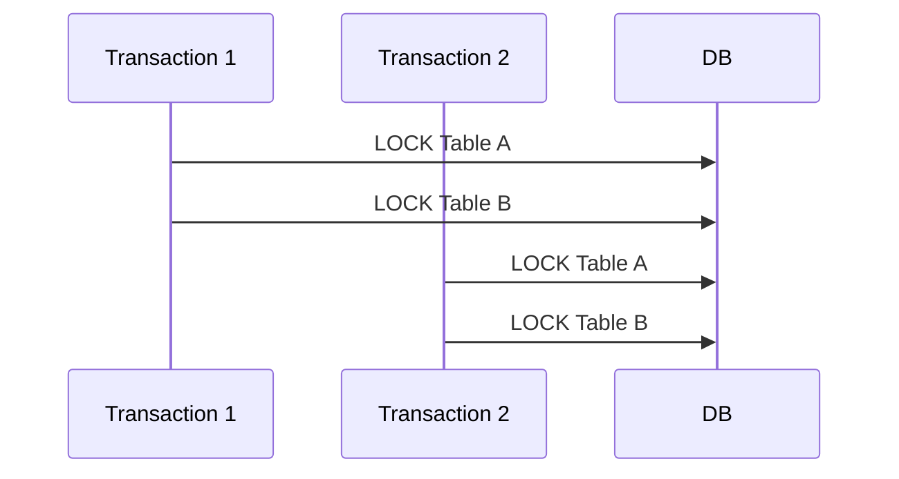
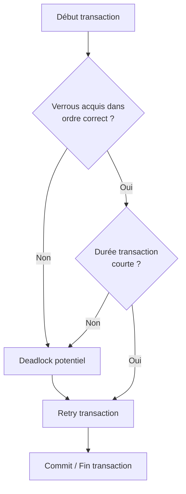

# Bonnes pratiques pour éviter les conflits de verrous dans PostgreSQL

La gestion des verrous dans PostgreSQL est cruciale pour assurer la cohérence des données et la performance des applications. Les conflits de verrous peuvent entraîner des blocages, des délais d'attente prolongés et parfois des deadlocks. Explorer les bonnes pratiques pour minimiser ces conflits permet d'améliorer la fluidité des transactions dans un environnement concurrent.

---

## 1. Acquérir les verrous dans un ordre cohérent

L’une des causes majeures de deadlocks est l’acquisition désordonnée des verrous sur les mêmes ressources par plusieurs transactions.

### Exemple d’ordre cohérent

Si plusieurs transactions doivent verrouiller les tables A et B, toujours verrouiller d’abord A puis B, dans le même ordre.



Cette discipline élimine les cycles d’attente.

---

## 2. Limiter la durée des transactions

Plus les transactions sont longues, plus le risque de conflits est élevé.

- Effectuer le minimum de logique dans la transaction  
- Ne débuter la transaction que juste avant les opérations critiques  
- Commiter ou rollback rapidement pour libérer les verrous

---

## 3. Utiliser judicieusement le niveau d’isolation

- Par défaut, PostgreSQL utilise `READ COMMITTED`, ce qui réduit les verrous longs.  
- `REPEATABLE READ` ou `SERIALIZABLE` peuvent générer plus de blocages.  
- Adapter le niveau d’isolation selon les besoins concrets permet d’équilibrer performance et cohérence.

---

## 4. Verrouillage explicite anticipé (`SELECT ... FOR UPDATE`)

Pour éviter les surprises, il est préférable de verrouiller explicitement les lignes avant modification.

```sql
BEGIN;
SELECT * FROM produits WHERE id = 123 FOR UPDATE;
UPDATE produits SET stock = stock - 1 WHERE id = 123;
COMMIT;
```

Cela garantit qu’aucune autre transaction ne modifie la ligne entre les lectures et les écritures.

---

## 5. Eviter les verrous inutiles sur les grandes ressources

Éviter d’utiliser des verrous lourds comme `LOCK TABLE` sur des tables volumineuses ou très sollicitées.

Préférer les verrous au niveau ligne (`Row-Level Locks`) quand c’est possible.

---

## 6. Gérer les erreurs de deadlock avec stratégie de retry

Même avec de bonnes pratiques, des deadlocks peuvent survenir. Il faut les détecter et relancer l’opération.

Exemple simple de retry en PL/pgSQL :

```plpgsql
DO $$
DECLARE
  tries INT := 3;
BEGIN
  WHILE tries > 0 LOOP
    BEGIN
      BEGIN TRANSACTION;
      -- Opérations critiques ici
      COMMIT;
      EXIT;
    EXCEPTION WHEN deadlock_detected THEN
      tries := tries - 1;
      PERFORM pg_sleep(0.1); -- pause avant retry
    END;
  END LOOP;

  IF tries = 0 THEN
    RAISE EXCEPTION 'Deadlock persistant après retries';
  END IF;
END;
$$;
```

---

## 7. Diagramme Mermaid : cycle de gestion des conflits



---

## 8. Sources et références

- [PostgreSQL Documentation - Explicit Locking](https://www.postgresql.org/docs/current/explicit-locking.html)  
- [Cybertec PostgreSQL - Deadlocks and Locking Best Practices](https://www.cybertec-postgresql.com/en/postgresql-deadlock-detection-and-avoidance/)  
- [DigitalOcean - How to Avoid Locks and Deadlocks in PostgreSQL](https://www.digitalocean.com/community/tutorials/how-to-avoid-locks-and-deadlocks-in-postgresql)  
- [SeveralNines - Best Practices for Managing Locks](https://severalnines.com/database-blog/locking-best-practices-postgresql)  

---

## Conclusion

Minimiser les conflits de verrous repose sur une acquisition ordonnée, des transactions courtes, un verrouillage explicite raisonné, et une bonne gestion des erreurs. Ces pratiques améliorent la performance des applications et assurent la robustesse du système de gestion de base de données PostgreSQL face à la concurrence.