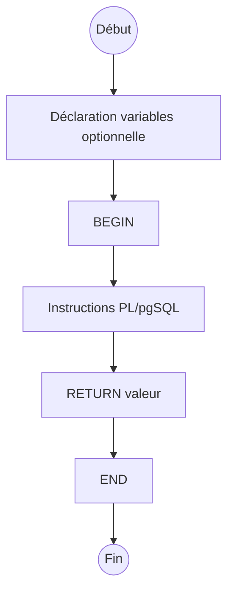

# Création de fonctions et procédures en PL/pgSQL : syntaxe et structure

PostgreSQL offre un puissant langage procédural nommé **PL/pgSQL** (Procedural Language/PostgreSQL) permettant de définir des fonctions et procédures stockées. Ce langage enrichit SQL avec des constructions de contrôle et un support complet de la programmation.

---

## 1. Distinction entre fonction et procédure

- **Fonction** : renvoie une valeur (un scalaire, une table, un type composite), peut être utilisée dans des requêtes SQL.  
- **Procédure** : introduite depuis PostgreSQL 11, ne renvoie pas de valeur, appelée avec `CALL`, idéale pour des traitements sans résultat direct.

---

## 2. Syntaxe générale d’une fonction PL/pgSQL

```sql
CREATE [OR REPLACE] FUNCTION nom_fonction(param1 type [, ...])
RETURNS type_de_retour AS $$
DECLARE
  -- Déclaration des variables locales (optionnel)
BEGIN
  -- Corps de la fonction (instructions PL/pgSQL)
  RETURN valeur;
END;
$$ LANGUAGE plpgsql;
```

### Points clés

- La clause `DECLARE` est optionnelle, elle est utilisée pour définir des variables locales.  
- Le mot-clé `RETURN` est obligatoire pour une fonction.  
- Le bloc `BEGIN ... END` encadre la logique procédurale.  
- On délimite généralement le code entre des marqueurs `$$` pour éviter d'avoir à échapper les apostrophes.

---

## 3. Exemples simples

### Fonction qui calcule la TVA (taux à 20%)

```sql
CREATE OR REPLACE FUNCTION calcul_tva(prix_ht NUMERIC)
RETURNS NUMERIC AS $$
BEGIN
  RETURN prix_ht * 0.20;
END;
$$ LANGUAGE plpgsql;
```

**Utilisation :**

```sql
SELECT calcul_tva(100);  -- renvoie 20
```

### Fonction avec déclaration de variable

```sql
CREATE OR REPLACE FUNCTION salutation(nom TEXT)
RETURNS TEXT AS $$
DECLARE
  message TEXT;
BEGIN
  message := 'Bonjour, ' || nom || '!';
  RETURN message;
END;
$$ LANGUAGE plpgsql;
```

---

## 4. Syntaxe d’une procédure

```sql
CREATE [OR REPLACE] PROCEDURE nom_procedure(param1 type [, ...])
LANGUAGE plpgsql AS $$
BEGIN
  -- instructions
END;
$$;
```

### Exemple simple d'une procédure

```sql
CREATE OR REPLACE PROCEDURE maj_solde(id_compte INT, montant NUMERIC)
LANGUAGE plpgsql AS $$
BEGIN
  UPDATE comptes SET solde = solde + montant WHERE id = id_compte;
END;
$$;
```

**Appel de la procédure :**

```sql
CALL maj_solde(1, 50);
```

---

## 5. Contrôle de flux dans PL/pgSQL

PL/pgSQL offre des structures classiques comme :

- `IF ... THEN ... ELSE ... END IF;`  
- `LOOP ... END LOOP;`  
- `WHILE ... LOOP ... END LOOP;`  
- `FOR var IN ... LOOP ... END LOOP;`  
- Gestion d’exceptions avec `EXCEPTION WHEN ... THEN ... END;`

### Exemple d’une fonction avec condition

```sql
CREATE OR REPLACE FUNCTION test_valeur(x INT)
RETURNS TEXT AS $$
BEGIN
  IF x > 0 THEN
    RETURN 'Positif';
  ELSIF x = 0 THEN
    RETURN 'Nul';
  ELSE
    RETURN 'Négatif';
  END IF;
END;
$$ LANGUAGE plpgsql;
```

---

## 6. Diagramme Mermaid : structure d’une fonction PL/pgSQL



---

## 7. Points pratiques

- Utiliser `CREATE OR REPLACE` pour faciliter la mise à jour des fonctions/procédures.  
- Toujours spécifier clairement le type de retour (`RETURNS`).  
- Les fonctions peuvent être utilisées dans des requêtes SQL, alors que les procédures sont appelées avec `CALL`.  
- Faciliter la lecture avec une indentation claire et des commentaires.

---

## 8. Sources et références

- [PostgreSQL Documentation - PL/pgSQL](https://www.postgresql.org/docs/current/plpgsql.html)  
- [PostgreSQL Documentation - CREATE FUNCTION](https://www.postgresql.org/docs/current/sql-createfunction.html)  
- [PostgreSQL Documentation - CREATE PROCEDURE](https://www.postgresql.org/docs/current/sql-createprocedure.html)  
- [Cybertec PostgreSQL - Introduction to PL/pgSQL](https://www.cybertec-postgresql.com/en/introduction-to-plpgsql-and-its-features/)  

---

## Conclusion

PL/pgSQL permet de créer des fonctions et procédures stockées robustes, modulaires et réutilisables. Comprendre clairement la syntaxe de déclaration et la structure des blocs facilite la conception d’applications complexes directement dans PostgreSQL avec logique métier optimisée.