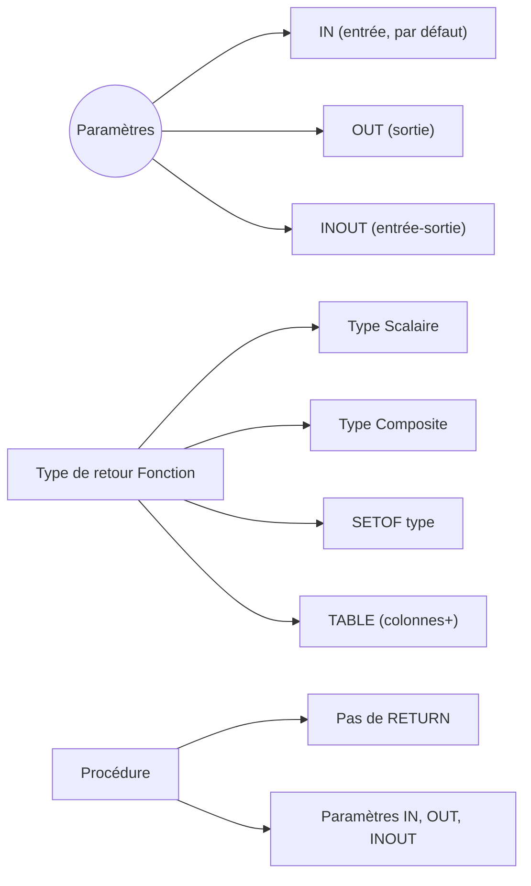

# Gestion des paramètres et types de retour dans les fonctions et procédures PL/pgSQL

La création de fonctions et procédures stockées en PostgreSQL s’appuie sur une gestion souple des paramètres et des types de retour. Maîtriser ces notions permet d’adapter précisément la signature des routines à des besoins métiers variés.

---

## 1. Types et modes des paramètres

Les fonctions et procédures PL/pgSQL acceptent plusieurs paramètres, pouvant être :

- **Paramètres IN** (entrée) : fournissent des valeurs à la fonction/procédure. Par défaut, tous les paramètres sont IN s’ils ne sont pas explicitement qualifiés.  
- **Paramètres OUT** (sortie) : retournent une ou plusieurs valeurs à la fin de l’exécution, disponibles seulement dans les fonctions (pas procédures).  
- **Paramètres INOUT** : agissent à la fois en entrée et en sortie.

### Exemple avec IN, OUT et INOUT

```sql
CREATE OR REPLACE FUNCTION example_func(
    a INT,             -- IN par défaut
    OUT b INT,
    INOUT c INT
) RETURNS RECORD AS $$
BEGIN
  b := a * 2;
  c := c + b;
END;
$$ LANGUAGE plpgsql;
```

**Appel :**

```sql
SELECT * FROM example_func(5, NULL, 10);
-- renvoie b=10, c=20
```

---

## 2. Passage des paramètres

- Positionnel : les arguments doivent suivre l’ordre des paramètres dans la signature.  
- Nommé : depuis PostgreSQL 9.0, on peut passer des arguments en spécifiant leur nom.

```sql
SELECT example_func(a => 5, c => 10);
```

---

## 3. Types de retour des fonctions

Une fonction doit toujours avoir un type de retour `RETURNS`. PostgreSQL supporte de nombreux types :

- **Types scalaires** : `INTEGER`, `TEXT`, `BOOLEAN`, `NUMERIC`, etc.  
- **Types composites** : tables ou types définis par l’utilisateur  
- **Type `SETOF type`** : retourne un ensemble de lignes de type donné  
- **Type `TABLE(col1 type, col2 type, ...)`** : syntaxe décrivant une table de résultats

---

### Exemple fonction retournant un `SETOF`

```sql
CREATE OR REPLACE FUNCTION get_users()
RETURNS SETOF users AS $$
BEGIN
  RETURN QUERY SELECT * FROM users;
END;
$$ LANGUAGE plpgsql;
```

### Exemple fonction retournant un type composite

```sql
CREATE TYPE genre_count AS (
  genre TEXT,
  count INT
);

CREATE OR REPLACE FUNCTION count_by_genre()
RETURNS SETOF genre_count AS $$
BEGIN
  RETURN QUERY
    SELECT genre, COUNT(*) FROM films GROUP BY genre;
END;
$$ LANGUAGE plpgsql;
```

---

## 4. Procédures et leur limitation sur le retour

Les procédures (introduites avec PostgreSQL 11) ne peuvent pas retourner de valeurs via `RETURN`. Elles peuvent cependant avoir des paramètres `INOUT` ou `OUT` pour transmettre des résultats.

```sql
CREATE OR REPLACE PROCEDURE proc_update_stock(
    IN prod_id INT,
    INOUT stock INT)
LANGUAGE plpgsql AS $$
BEGIN
  UPDATE produits SET stock = stock - 1 WHERE id = prod_id;
  stock := stock - 1;
END;
$$;
```

---

## 5. Diagramme Mermaid : gestion des paramètres et type de retour



---

## 6. Bonnes pratiques

- Choisir le mode de paramètres adaptés (éviter l’abus des paramètres OUT pour garder la clarté).  
- Utiliser `RETURNS TABLE` ou `SETOF` pour retourner plusieurs lignes clairement.  
- Pour procédures, privilégier les paramètres IN/OUT et ne pas compter sur `RETURN`.  
- Toujours documenter la signature pour faciliter la maintenance.

---

## 7. Sources et références

- [PostgreSQL Documentation - CREATE FUNCTION](https://www.postgresql.org/docs/current/sql-createfunction.html)  
- [PostgreSQL Documentation - PL/pgSQL - Parameters](https://www.postgresql.org/docs/current/plpgsql-parameters.html)  
- [PostgreSQL Documentation - CREATE PROCEDURE](https://www.postgresql.org/docs/current/sql-createprocedure.html)  
- [Cybertec PostgreSQL - Guide on Function Parameters](https://www.cybertec-postgresql.com/en/function-parameters-in-postgresql/)  

---

## Conclusion

La gestion fine des paramètres (IN/OUT/INOUT) et des types de retour en PL/pgSQL constitue l’un des leviers essentiels pour concevoir des fonctions et procédures efficaces et claires. Ce savoir-faire vous permet d’adapter vos routines stockées à des besoins complexes, de favoriser la réutilisabilité et de simplifier leur utilisation dans l’ensemble des applications PostgreSQL.