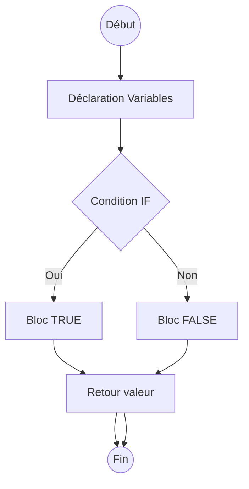

# Utilisation des variables et contrôle de flux dans les fonctions avancées PL/pgSQL

PL/pgSQL, langage procédural de PostgreSQL, offre des fonctionnalités avancées au-delà du simple SQL, notamment la gestion de variables locales et des structures de contrôle de flux. Ces fonctionnalités permettent d’écrire des fonctions et procédures complexes, modulaires et dynamiques directement dans la base.

---

## 1. Déclaration et utilisation des variables

Les variables se déclarent dans la section `DECLARE` d’une fonction ou procédure. Elles peuvent être typées et initialisées.

### Syntaxe générale

```plpgsql
DECLARE
  nom_variable type_variable [:= valeur_initiale];
```

### Exemple

```sql
CREATE OR REPLACE FUNCTION exemple_variables()
RETURNS TEXT AS $$
DECLARE
  compteur INT := 0;
  message TEXT;
BEGIN
  compteur := compteur + 1;
  message := 'Valeur compteur : ' || compteur;
  RETURN message;
END;
$$ LANGUAGE plpgsql;
```

Ce mécanisme permet de stocker temporairement des données ou résultats intermédiaires.

---

## 2. Contrôle de flux : structures conditionnelles

PL/pgSQL supporte des structures classiques de décisions :

- **IF / ELSIF / ELSE / END IF**  
- **CASE / WHEN / ELSE / END CASE**

### Exemple avec IF

```plpgsql
CREATE OR REPLACE FUNCTION verifier_age(age INT)
RETURNS TEXT AS $$
BEGIN
  IF age < 18 THEN
    RETURN 'Mineur';
  ELSIF age BETWEEN 18 AND 65 THEN
    RETURN 'Adulte';
  ELSE
    RETURN 'Senior';
  END IF;
END;
$$ LANGUAGE plpgsql;
```

---

## 3. Contrôle de flux : boucles

Plusieurs types de boucles sont présentes :

- `LOOP ... END LOOP;` : boucle infinie à contrôler manuellement avec `EXIT`  
- `WHILE condition LOOP ... END LOOP;`  
- `FOR var IN [REVERSE] expression LOOP ... END LOOP;`  
- `FOREACH element IN ARRAY tableau LOOP ... END LOOP;`

### Exemple d’une boucle WHILE

```plpgsql
CREATE OR REPLACE FUNCTION somme_jusqua(n INT)
RETURNS INT AS $$
DECLARE
  total INT := 0;
  compteur INT := 1;
BEGIN
  WHILE compteur <= n LOOP
    total := total + compteur;
    compteur := compteur + 1;
  END LOOP;
  RETURN total;
END;
$$ LANGUAGE plpgsql;
```

---

## 4. Gestion des exceptions

PL/pgSQL permet de gérer les erreurs avec un bloc `EXCEPTION`.

```plpgsql
BEGIN
  -- code potentiellement dangereux
EXCEPTION
  WHEN division_by_zero THEN
    -- gestion spécifique
  WHEN OTHERS THEN
    -- autre gestion
END;
```

### Exemple

```plpgsql
CREATE OR REPLACE FUNCTION division(a INT, b INT)
RETURNS NUMERIC AS $$
BEGIN
  RETURN a / b;
EXCEPTION
  WHEN division_by_zero THEN
    RETURN NULL; -- éviter une erreur fatale
END;
$$ LANGUAGE plpgsql;
```

---

## 5. Diagramme Mermaid : exemple de contrôle de flux simple



---

## 6. Concaténer variables et paramètres

Il est courant de construire des chaînes dynamiques :

```plpgsql
DECLARE
  message TEXT;
BEGIN
  message := 'Bonjour ' || nom_utilisateur || ', bienvenue!';
  RETURN message;
END;
```

Le `||` est l’opérateur de concaténation SQL standard.

---

## 7. Cas d’usage avancé

Une fonction qui boucle sur des résultats d’une requête et accumule une valeur :

```plpgsql
CREATE OR REPLACE FUNCTION total_commandes(client_id INT)
RETURNS NUMERIC AS
$$
DECLARE
  commande RECORD;
  total NUMERIC := 0;
BEGIN
  FOR commande IN SELECT montant FROM commandes WHERE client = client_id LOOP
    total := total + commande.montant;
  END LOOP;
  RETURN total;
END;
$$ LANGUAGE plpgsql;
```

---

## 8. Sources et références

- [PostgreSQL Documentation - PL/pgSQL - Control Structures](https://www.postgresql.org/docs/current/plpgsql-control-structures.html)  
- [PostgreSQL Documentation - PL/pgSQL - Variables](https://www.postgresql.org/docs/current/plpgsql-declarations.html)  
- [Cybertec PostgreSQL - Control Structures in PL/pgSQL](https://www.cybertec-postgresql.com/en/control-structures-plpgsql/)  
- [PostgreSQL Tutorial - PL/pgSQL Looping](https://www.postgresqltutorial.com/plpgsql-tutorial/plpgsql-loop/)  

---

## Conclusion

La puissance de PL/pgSQL réside dans sa capacité à manipuler des variables et à contrôler précisément l’exécution grâce à des conditions, boucles, et gestion d’exceptions. Ces outils permettent de concevoir des logiques métier complexes et réactives intégrées côté serveur, optimisant ainsi accès et traitement des données.