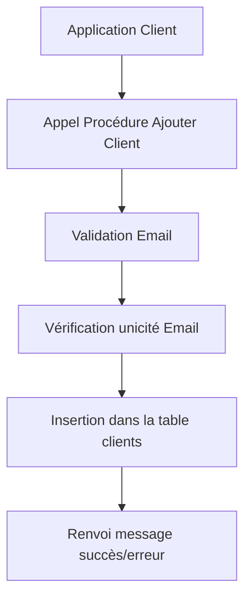

# Encapsulation de la logique métier dans la base PostgreSQL à l’aide de fonctions et procédures stockées

L’encapsulation de la logique métier directement dans la base de données via des fonctions et procédures stockées offre plusieurs avantages : centralisation des règles, cohérence des données, amélioration des performances et sécurisation des traitements.

---

## 1. Pourquoi encapsuler la logique métier en base ?

- **Uniformité** : une même règle est appliquée partout où les données sont manipulées.  
- **Performance** : les traitements s’exécutent côté serveur, limitant les allers-retours réseau.  
- **Sécurité** : limitation des erreurs et contrôle d’accès via des privilèges sur les fonctions.  
- **Maintenance facilitée** : centralisation dans la base évite la duplication dans plusieurs couches applicatives.

---

## 2. Exemple simple : fonction de validation d’un email

Créer une fonction qui valide la syntaxe d’un email selon une règle métier permet d’éviter que la validation soit répliquée partout.

```sql
CREATE OR REPLACE FUNCTION est_email_valide(email TEXT)
RETURNS BOOLEAN AS $$
BEGIN
  RETURN email ~* '^[A-Za-z0-9._%+-]+@[A-Za-z0-9.-]+\.[A-Za-z]{2,}$';
END;
$$ LANGUAGE plpgsql IMMUTABLE;
```

Cette fonction utilise une expression régulière et peut être appelée avant insertion ou mise à jour.

---

## 3. Encapsulation dans une procédure d’ajout client

Illusionnons une procédure qui encapsule la logique d’ajout client avec vérification et insertion.

```sql
CREATE OR REPLACE PROCEDURE ajouter_client(
  p_nom TEXT, p_email TEXT, OUT p_message TEXT
)
LANGUAGE plpgsql AS $$
BEGIN
  IF NOT est_email_valide(p_email) THEN
    p_message := 'Email invalide.';
    RETURN;
  END IF;

  IF EXISTS (SELECT 1 FROM clients WHERE email = p_email) THEN
    p_message := 'Email déjà utilisé.';
    RETURN;
  END IF;

  INSERT INTO clients(nom, email) VALUES (p_nom, p_email);
  p_message := 'Client ajouté avec succès.';
END;
$$;
```

Cette procédure garantit que la logique est appliquée systématiquement.

---

## 4. Avantages de l’encapsulation dans les triggers

L’encapsulation peut être combinée avec des triggers pour automatiser la vérification ou la mise à jour.

```sql
CREATE OR REPLACE FUNCTION avant_ajout_client()
RETURNS TRIGGER AS $$
BEGIN
  IF NOT est_email_valide(NEW.email) THEN
    RAISE EXCEPTION 'Email invalide.';
  END IF;
  RETURN NEW;
END;
$$ LANGUAGE plpgsql;

CREATE TRIGGER trigger_validation_email
BEFORE INSERT ON clients
FOR EACH ROW EXECUTE FUNCTION avant_ajout_client();
```

---

## 5. Diagramme Mermaid : encapsulation de logique métier



---

## 6. Bonnes pratiques

- Utiliser les fonctions `IMMUTABLE` ou `STABLE` lorsque cela est possible pour améliorer la performance.  
- Garder la logique claire et modulaire en créant des fonctions réutilisables.  
- Protéger l’accès aux routines avec des droits PostgreSQL précis.  
- Documenter la logique métier pour faciliter la compréhension future.

---

## 7. Sources et références

- [PostgreSQL Documentation - PL/pgSQL](https://www.postgresql.org/docs/current/plpgsql.html)  
- [PostgreSQL Documentation - Triggers](https://www.postgresql.org/docs/current/triggers.html)  
- [Cybertec PostgreSQL - Business Logic in Database](https://www.cybertec-postgresql.com/en/postgresql-data-integrity-and-business-logic-with-plpgsql-and-triggers/)  
- [PostgreSQL Tutorial - Functions and Procedures](https://www.postgresqltutorial.com/postgresql-functions/)  

---

Encapsuler la logique métier dans la base PostgreSQL via fonctions, procédures et triggers garantit des traitements cohérents, optimisés et facilement maintenables, tout en sécurisant l’intégrité des données manipulées.