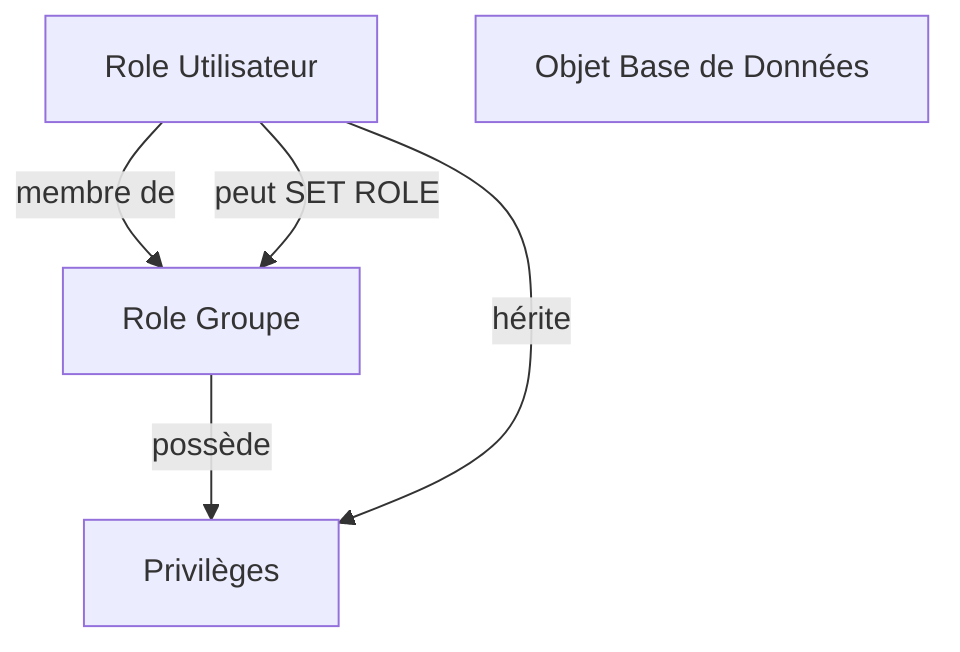

# Hiérarchie et héritage des permissions dans le modèle de sécurité PostgreSQL

PostgreSQL propose un système de gestion des permissions basé sur des rôles organisés en hiérarchies, avec un mécanisme d’héritage qui simplifie l’administration des droits d’accès. Comprendre la manière dont les permissions se propagent entre rôles et comment gérer cette hiérarchie est indispensable pour gérer efficacement la sécurité.

---

## 1. Rôle, groupes et héritage

En PostgreSQL, un **rôle** peut jouer le rôle d’utilisateur ou de groupe (rôle non connecté). Lorsqu’un rôle est membre d’un autre, il peut hériter des privilèges de ce dernier.

L’**héritage** est automatique par défaut pour faciliter la transmission des permissions. Par exemple, si le rôle `alice` est membre du groupe `devs`, alors `alice` bénéficie des privilèges attribués à `devs`.

### Exemple : création de rôles avec héritage automatique

```sql
CREATE ROLE devs NOLOGIN;
CREATE ROLE alice LOGIN PASSWORD 'secure123';

GRANT devs TO alice;
```

Ici, `alice` hérite des permissions de `devs`.

---

## 2. Contrôle de l’héritage avec NOINHERIT

Par défaut, un rôle hérite automatiquement des permissions de ses groupes. Toutefois, il est possible de désactiver ce comportement via l’attribut `NOINHERIT`. Dans ce cas, le rôle ne reçoit pas automatiquement les droits des rôles dont il est membre, sauf si ces derniers sont explicitement utilisés dans la requête.

```sql
CREATE ROLE supervision NOLOGIN NOINHERIT;
CREATE ROLE bob LOGIN PASSWORD 'pass456';

GRANT supervision TO bob;
```

Dans cet exemple, `bob` ne bénéficie pas automatiquement des permissions du rôle `supervision` sauf s’il agit explicitement sous ce rôle (`SET ROLE supervision`).

---

## 3. Inheritance en action : accès aux objets

Les permissions sur les objets (tables, vues, fonctions) peuvent être attribuées à des rôles groupes, et par héritage aux membres.

```sql
GRANT SELECT ON table_clients TO devs;
-- alice héritera donc du droit SELECT sur cette table
```

---

## 4. Modification de rôle pendant une session (SET ROLE)

Pour utiliser explicitement les permissions d’un autre rôle (notamment avec `NOINHERIT`), un utilisateur peut changer son rôle courant :

```sql
SET ROLE devs;
-- La session agit avec les privilèges du rôle devs
RESET ROLE;
```

Cette fonctionnalité permet un accès temporaire et contrôlé à des droits supplémentaires.

---

## 5. Exemple complet avec héritage et contrôle d’accès

```sql
-- Création du groupe et de l'utilisateur
CREATE ROLE managers NOLOGIN;
CREATE ROLE sophie LOGIN PASSWORD 'mdp';

-- Attribution de droit au groupe
GRANT SELECT, UPDATE ON table_projets TO managers;

-- Attribution du groupe à l'utilisateur
GRANT managers TO sophie;

-- Par défaut sophie hérite des droits sur table_projets
```

Si l’on voulait interdire l’héritage automatique:

```sql
ALTER ROLE managers NOINHERIT;
```

Pour que `sophie` puisse accéder aux privilèges :

```sql
SET ROLE managers;
-- accès aux privilèges de managers
RESET ROLE;
```

---

## 6. Diagramme Mermaid : relations et héritage des rôles



---

## 7. Résumé des commandes clés

| Commande                 | Description                             |
|--------------------------|---------------------------------------|
| `CREATE ROLE`            | Créer un rôle (utilisateur/groupe)   |
| `GRANT role TO role`     | Ajouter un rôle en membre d'un autre  |
| `ALTER ROLE ... NOINHERIT` | Désactiver l’héritage automatique    |
| `SET ROLE`               | Changer le rôle actif dans la session |
| `RESET ROLE`             | Revenir au rôle initial                |

---

## 8. Références bibliographiques

- [PostgreSQL Documentation - Role Membership and Inheritance](https://www.postgresql.org/docs/current/user-manag.html#USER-MANAG-ROLES)  
- [PostgreSQL Documentation - Role Attributes](https://www.postgresql.org/docs/current/sql-createrole.html)  
- [Cybertec PostgreSQL - User and Role Management](https://www.cybertec-postgresql.com/en/postgresql-user-management/)  
- [Official PostgreSQL Wiki - Roles and Permissions](https://wiki.postgresql.org/wiki/User_Management)  

---

Le mécanisme d’héritage des permissions dans PostgreSQL optimise la gestion des droits en permettant des architectures simples et modulaires, tout en garantissant un contrôle granulaire grâce à des options comme `NOINHERIT` et `SET ROLE`.