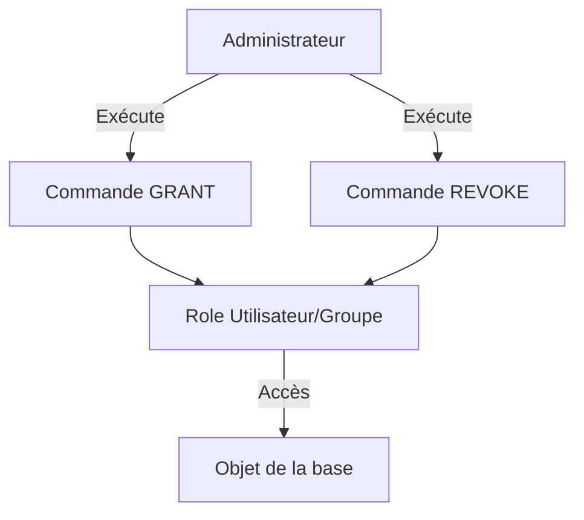

# Attribution et révocation de privilèges dans PostgreSQL

La gestion fine des permissions est essentielle pour sécuriser l’accès aux objets en base PostgreSQL. L’attribution (`GRANT`) et la révocation (`REVOKE`) de privilèges permettent de contrôler qui peut lire, modifier ou administrer les données et les ressources.

---

## 1. Concepts clés des privilèges

PostgreSQL propose différents types de privilèges selon les objets :

| Objet             | Privilèges fréquents                             |
|-------------------|-------------------------------------------------|
| Table             | SELECT, INSERT, UPDATE, DELETE, TRUNCATE, REFERENCES, TRIGGER |
| Séquence          | USAGE, SELECT, UPDATE                            |
| Fonction          | EXECUTE                                         |
| Schéma            | USAGE, CREATE                                   |
| Base de données   | CONNECT                                         |

Les privilèges peuvent être octroyés à des rôles (utilisateurs ou groupes).

---

## 2. Syntaxe d’attribution des privilèges

```sql
GRANT privilège1, privilège2 ON objet_type objet TO role [WITH GRANT OPTION];
```

Exemple : accorder à un rôle `developpeurs` le droit de lecture et d’écriture sur la table `clients` :

```sql
GRANT SELECT, INSERT, UPDATE ON TABLE clients TO developpeurs;
```

L’option `WITH GRANT OPTION` permet au rôle bénéficiaire de déléguer ce droit à d’autres utilisateurs.

---

## 3. Révocation des privilèges

Pour retirer des privilèges, on utilise :

```sql
REVOKE privilège1, privilège2 ON objet_type objet FROM role;
```

Exemple : retirer les droits d’écriture du rôle `developpeurs` sur `clients` :

```sql
REVOKE INSERT, UPDATE ON TABLE clients FROM developpeurs;
```

---

## 4. Exemple complet : gestion des privilèges sur une table

```sql
-- Création d'un rôle groupe
CREATE ROLE analyseurs NOLOGIN;

-- Attribution du droit lecture
GRANT SELECT ON TABLE ventes TO analyseurs;

-- Attribution du rôle à un utilisateur
GRANT analyseurs TO alice;

-- Retirer le droit lecture
REVOKE SELECT ON TABLE ventes FROM analyseurs;
```

---

## 5. Privileges par défaut et commandes complémentaires

- Les nouveaux objets héritent des privilèges par défaut définis par `ALTER DEFAULT PRIVILEGES`.  
- Pour voir les permissions sur un objet, utiliser :

```sql
\d table_nommée
```

- Pour lister les privilèges dans la base, une requête sur `information_schema.role_table_grants` est possible.

---

## 6. Gestion des privilèges sur fonctions et schémas

Exemple d’attribution de l’exécution d’une fonction :

```sql
GRANT EXECUTE ON FUNCTION calcul_taxe(numeric) TO comptables;
```

Exemple sur un schéma :

```sql
GRANT USAGE ON SCHEMA finances TO equipe_finance;
```

---

## 7. Diagramme Mermaid : attribution et révocation de privilèges



---

## 8. Sources et références

- [PostgreSQL Documentation - GRANT](https://www.postgresql.org/docs/current/sql-grant.html)  
- [PostgreSQL Documentation - REVOKE](https://www.postgresql.org/docs/current/sql-revoke.html)  
- [Cybertec PostgreSQL - Managing Privileges](https://www.cybertec-postgresql.com/en/postgresql-privileges/)  
- [PostgreSQL Tutorial - Grant and Revoke](https://www.postgresqltutorial.com/postgresql-grant-revoke/)  

---

Attribuer et révoquer les permissions de manière appropriée protège les données tout en facilitant la collaboration. La maîtrise fine des commandes `GRANT` et `REVOKE` dans PostgreSQL est une compétence fondamentale de l’administration sécurisée des bases de données.