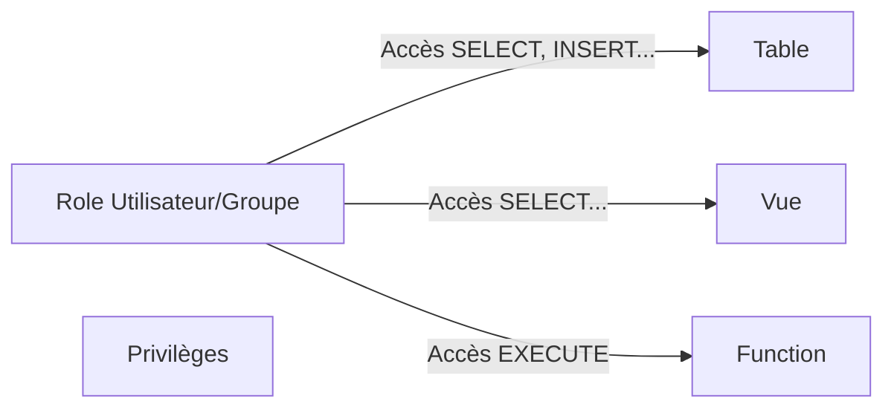

# Sécurité au niveau des objets dans PostgreSQL : tables, vues et fonctions

Dans PostgreSQL, la sécurité s'exerce en contrôlant précisément les accès aux objets de la base : tables, vues, fonctions. La gestion des permissions au niveau de ces objets permet d’assurer que seules les entités autorisées effectuent des opérations spécifiques, renforçant l’intégrité et la confidentialité des données.

---

## 1. Objets concernés et privilèges associés

| Type d’objet | Privileges principaux                 |
|--------------|------------------------------------|
| Table        | SELECT, INSERT, UPDATE, DELETE, TRUNCATE, REFERENCES, TRIGGER |
| Vue          | Identiques aux tables (dépend de la définition) |
| Fonction     | EXECUTE                             |

---

## 2. Contrôle d’accès aux tables

Les permissions sur les tables permettent de gérer qui peut lire, modifier, insérer, supprimer des données.

### Exemple : accorder des droits sur une table

```sql
GRANT SELECT, INSERT ON TABLE clients TO equipe_vente;
```

L’équipe de vente pourra interroger et insérer des lignes dans la table `clients`.

### Révocation

```sql
REVOKE INSERT ON TABLE clients FROM equipe_vente;
```

---

## 3. Spécificités pour les vues

Les vues sont des tables virtuelles issues de requêtes. Les permissions pour accéder et manipuler des vues sont similaires à celles des tables, mais exécutées via la requête sous-jacente.

Un utilisateur doit avoir les droits nécessaires sur les tables sous-jacentes pour insérer ou mettre à jour via une vue modifiable.

```sql
GRANT SELECT ON clients_vue TO analystes;
```

---

## 4. Sécurité sur les fonctions stockées

Les fonctions ou procédures sont des unités logiques pouvant encapsuler l'accès aux données.

### Privilege `EXECUTE`

Il permet d’autoriser l’exécution d’une fonction précise.

```sql
GRANT EXECUTE ON FUNCTION calcul_taxe(numeric) TO comptables;
```

---

## 5. Fonction Security Definer vs Security Invoker

Par défaut, une fonction s’exécute avec les droits du **propriétaire** de la fonction — c’est le comportement *security definer* qui autorise à contrôler strictement les opérations potentiellement sensibles.  

```sql
CREATE OR REPLACE FUNCTION secret_func()
RETURNS void
LANGUAGE plpgsql
SECURITY DEFINER -- s'exécute avec les droits du propriétaire
AS $$
BEGIN
  -- code sensible
END;
$$;
```

Cela permet à des utilisateurs sans accès direct aux tables sous-jacentes d’exécuter des fonctions spécifiques sécurisées.

---

## 6. Diagramme Mermaid : gestion des permissions sur objets



---

## 7. Bonnes pratiques

- Accorder uniquement les privilèges nécessaires (`principe du moindre privilège`).  
- Utiliser les fonctions `SECURITY DEFINER` pour encapsuler la logique sensible.  
- Contrôler strictement l’accès aux objets, surtout en environnement partagé.  
- Documenter clairement les attributions de droit pour audit et maintenance.

---

## 8. Sources et références

- [PostgreSQL Documentation - GRANT](https://www.postgresql.org/docs/current/sql-grant.html)  
- [PostgreSQL Documentation - Security Definer Functions](https://www.postgresql.org/docs/current/sql-createfunction.html#SQL-CREATEFUNCTION-SECURITY-CLAUSES)  
- [Cybertec PostgreSQL - Database Object Permissions](https://www.cybertec-postgresql.com/en/managing-database-object-privileges-in-postgresql/)  
- [PostgreSQL Tutorial - Views and Security](https://www.postgresqltutorial.com/postgresql-views/)  

---

La gestion granulaire des permissions sur tables, vues et fonctions dans PostgreSQL est un levier essentiel pour protéger l’intégrité et la confidentialité des données. La flexibilité offerte permet d’adapter les droits au contexte métier tout en maîtrisant les risques liés à l’accès aux informations.