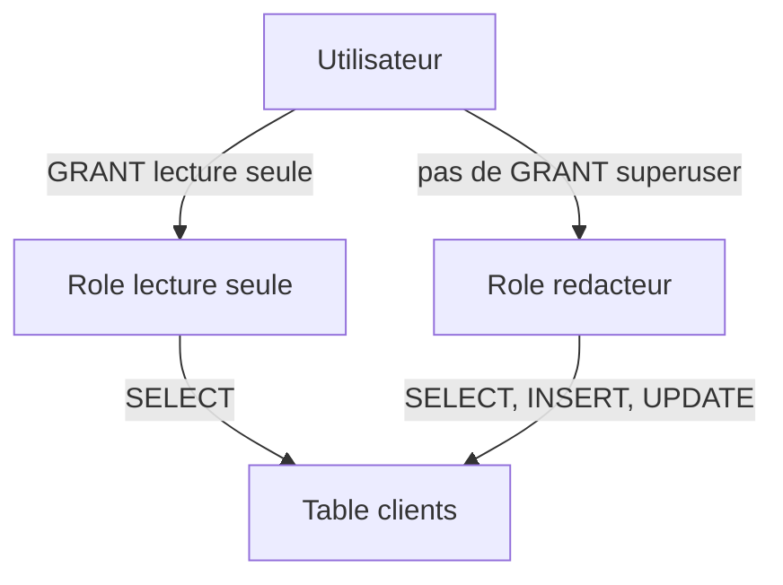

# Principes du moindre privilège dans PostgreSQL : sécuriser l’accès aux données

Le **principe du moindre privilège** consiste à attribuer à chaque utilisateur ou processus uniquement les permissions nécessaires à son fonctionnement, rien de plus. Cette règle simple mais puissante limite les risques d’erreurs, de fuites de données et d’exploitation malveillante.

---

## 1. Comprendre le principe du moindre privilège

Attribuer trop de permissions expose la base à des actions non désirées, qu’elles soient accidentelles ou malveillantes. Le moindre privilège :

- Limite les possibilités d’erreur humaine  
- Contribue à réduire la surface d’attaque  
- Facilite le contrôle et l’audit des accès

Dans PostgreSQL, ce principe s’applique à la gestion fine des rôles et des privilèges sur les objets.

---

## 2. Mise en œuvre dans PostgreSQL

### Étape 1 : Créer des rôles spécifiques par fonction

Au lieu d’accorder des droits très larges à un utilisateur, créer des rôles adaptés aux besoins précis.

```sql
CREATE ROLE lecture_seule NOLOGIN;
GRANT SELECT ON ALL TABLES IN SCHEMA public TO lecture_seule;

CREATE ROLE redacteur NOLOGIN;
GRANT SELECT, INSERT, UPDATE ON TABLE clients TO redacteur;
```

### Étape 2 : Attribuer aux utilisateurs uniquement les rôles nécessaires

```sql
CREATE ROLE luc LOGIN PASSWORD 'secret';
GRANT lecture_seule TO luc;
```

---

## 3. Restriction des privilèges SUPERUSER

Éviter de donner le rôle `SUPERUSER` sauf en cas de besoin absolu. Un superutilisateur peut, par définition, contourner toutes les règles de sécurité.

---

## 4. Surveillance et audit des privilèges

Utiliser la commande `\du` dans psql pour voir les rôles et leurs attributs.  

Pour les privilèges d’objets : interroger `information_schema.role_table_grants`.

```sql
SELECT grantee, table_name, privilege_type
FROM information_schema.role_table_grants
WHERE grantee = 'luc';
```

---

## 5. Diagramme Mermaid : approche du moindre privilège



---

## 6. Exemple pratique : permission temporaire via SET ROLE

Pour une tâche administrative ponctuelle, ne pas changer durablement les droits mais utiliser :

```sql
SET ROLE redacteur;
-- opération avec privilèges
RESET ROLE;
```

---

## 7. Références et sources

- [PostgreSQL Official Documentation - Rights and Privileges](https://www.postgresql.org/docs/current/user-manag.html#USER-MANAG-ACCESS-PRIV)  
- [OWASP - Principle of Least Privilege](https://owasp.org/www-community/Least_Privilege)  
- [Cybertec PostgreSQL - User Management](https://www.cybertec-postgresql.com/en/postgresql-user-management/)  
- [PostgreSQL Tutorial - Roles and Privileges](https://www.postgresqltutorial.com/postgresql-roles/)  

---

Le respect strict du principe du moindre privilège dans PostgreSQL minimise les risques de compromission et facilite la gouvernance de la sécurité. C’est un levier fondamental pour bâtir une politique d’accès robuste et cohérente.