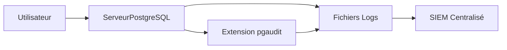

# Utilisation des audits et logs dans PostgreSQL pour renforcer la sécurité

La surveillance des activités dans une base de données est une composante clé de la sécurité. PostgreSQL intègre des mécanismes de journalisation (logs) et des outils d’audit qui permettent de retracer les actions, détecter des anomalies, et garantir la conformité.

---

## 1. Journalisation native dans PostgreSQL

PostgreSQL produit des logs détaillés sur les connexions, requêtes, erreurs, et autres événements. Pour activer et configurer les logs, on modifie le fichier `postgresql.conf`.

### Paramètres clés

| Paramètre                 | Description                                         |
|---------------------------|---------------------------------------------------|
| `logging_collector`       | Active la capture des logs                         |
| `log_directory`           | Répertoire de stockage des fichiers log            |
| `log_filename`            | Nom des fichiers log                               |
| `log_statement`           | Niveau de log des requêtes (none, ddl, mod, all)  |
| `log_duration`            | Durée d’exécution des requêtes                     |
| `log_connections`         | Log des connexions                                 |
| `log_disconnections`      | Log des déconnexions                              |

### Exemple de configuration simple

```conf
logging_collector = on
log_directory = 'pg_log'
log_filename = 'postgresql-%Y-%m-%d.log'
log_statement = 'ddl'
log_connections = on
log_disconnections = on
```

---

## 2. Extension `pgaudit` pour un audit détaillé

Le module `pgaudit` étend les capacités natives en fournissant un audit détaillé des commandes SQL exécutées par les utilisateurs.

### Installation et activation

```sql
CREATE EXTENSION pgaudit;
```

Ajout dans `postgresql.conf` :

```conf
shared_preload_libraries = 'pgaudit'
pgaudit.log = 'read, write, ddl'
```

Cela permet d’avoir des logs d’audit spécifiques et plus granuleux, par exemple pour :

- Lire les requêtes SELECT (read)  
- Modifier des données (write)  
- Modifier la structure (ddl)  

---

## 3. Exemple d’analyse de logs

Supposons rechercher toutes les connexions suspectes ou récurrentes d’un utilisateur :

```bash
grep "connection authorized: user=alice" postgresql-2024-06-01.log
```

Pour analyser les opérations sensibles, consulter les logs produits par pgaudit.

---

## 4. Intégration dans des solutions d’audit externes

Les logs PostgreSQL peuvent être envoyés vers des systèmes centralisés (SIEM) via syslog ou journaux partagés, pour enrichir la surveillance globale.

---

## 5. Diagramme Mermaid : chaîne d’audit PostgreSQL



---

## 6. Bonnes pratiques liées aux audits et logs

- Activer la journalisation complète des connexions et requêtes importantes.  
- Utiliser `pgaudit` pour tracer finement les activités SQL.  
- Centraliser les logs dans un système externe pour corrélation et conservation.  
- Mettre en place des alertes sur comportements anormaux détectés dans les logs.  
- Assurer la protection et l’intégrité des fichiers de logs.  

---

## 7. Sources et références

- [PostgreSQL Documentation - Server Configuration  Logging](https://www.postgresql.org/docs/current/runtime-config-logging.html)  
- [pgaudit Extension Documentation](https://www.pgaudit.org/docs/)  
- [Cybertec PostgreSQL - Auditing PostgreSQL with pgaudit](https://www.cybertec-postgresql.com/en/auditing-postgresql-with-pgaudit/)  
- [PostgreSQL wiki - Auditing](https://wiki.postgresql.org/wiki/Auditing)  

---

L’exploitation combinée des logs natifs et des audits via `pgaudit` constitue un socle robuste pour surveiller et sécuriser les bases PostgreSQL, garantissant transparence et traçabilité des actions.