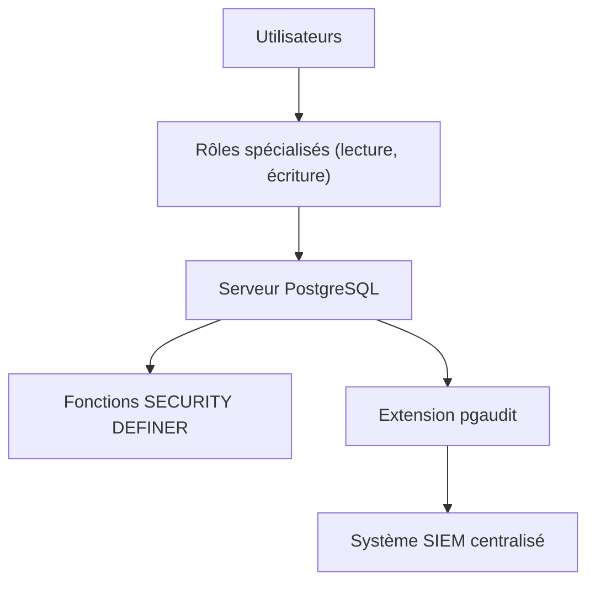

# Stratégies de sécurité et d’audit pour environnements critiques sous PostgreSQL

Les environnements critiques, comme les systèmes financiers, médicaux ou gouvernementaux, nécessitent une sécurité renforcée et une gouvernance rigoureuse. PostgreSQL offre plusieurs leviers et bonnes pratiques pour protéger, auditer et contrôler les accès dans ces contextes exigeants.

---

## 1. Mise en place d’une politique stricte des privilèges

**Principe du moindre privilège** : n’attribuer que les droits nécessaires, ni plus ni moins, sur les objets (tables, fonctions, schémas).

Exemple : créer des rôles spécialisés et limiter les accès directs aux tables sensibles.

```sql
CREATE ROLE finance_lecture NOLOGIN;
GRANT SELECT ON TABLE transactions TO finance_lecture;

CREATE ROLE finance_ecriture NOLOGIN;
GRANT INSERT, UPDATE ON TABLE transactions TO finance_ecriture;

GRANT finance_lecture TO alice;
```

---

## 2. Utilisation renforcée des fonctions `SECURITY DEFINER`

Les fonctions marquées `SECURITY DEFINER` s’exécutent avec les droits de leur propriétaire plutôt que de l’utilisateur appelant, permettant d’encapsuler la logique sensible.

Cela réduit le besoin d’attribuer des droits élevés à un grand nombre d’utilisateurs.

---

## 3. Audit actif via `pgaudit` et logs centralisés

L’extension [pgaudit](https://www.pgaudit.org/) offre un audit précis des requêtes SQL (DDL, DML, lecture, modifications).

- Activer pgaudit avec une configuration fine (par exemple, audit des modifications uniquement).  
- Centraliser les logs dans un système SIEM (Security Information and Event Management).

---

## 4. Gestion des accès temporaires et contrôlés

Utiliser `SET ROLE` pour des élévations ponctuelles, sans modifier durablement les droits :

```sql
SET ROLE admin_temporarily;
-- Opérations administratives
RESET ROLE;
```

Pour limiter le risque en environnement critique.

---

## 5. Sauvegarde régulière des configurations et audits

Conserver une trace des configurations de rôles, permissions, politiques de sécurité et logs.

Automatiser la collecte pour pouvoir restaurer rapidement l’état sécurisé en cas d’incident.

---

## 6. Diagramme Mermaid : architecture sécurisée d’un environnement critique PostgreSQL



---

## 7. Bonnes pratiques adaptées à ces environnements

- **Séparation stricte des rôles** : éviter que des utilisateurs cumulent trop de permissions.  
- **Revue périodique des droits** : contrôles réguliers et audits formels.  
- **Chiffrement des connexions** via SSL/TLS pour éviter les écoutes réseaux.  
- **Mise en place de la journalisation détaillée** avec conservation longue durée.  
- **Formation des utilisateurs** sur les bonnes pratiques et risques.

---

## 8. Sources et références

- [PostgreSQL Documentation - Security Definer Functions](https://www.postgresql.org/docs/current/sql-createfunction.html#SQL-CREATEFUNCTION-SECURITY-CLAUSES)  
- [pgaudit official site](https://www.pgaudit.org/)  
- [PostgreSQL Security Best Practices - Cybertec](https://www.cybertec-postgresql.com/en/postgresql-security-best-practices/)  
- [NIST Guide on Database Security](https://csrc.nist.gov/publications/detail/sp/800-213/final)  

---

La gestion sécurisée d’environnements PostgreSQL critiques repose sur un contrôle strict des accès, un audit approfondi et continu, ainsi que sur des pratiques opérationnelles rigoureuses. Une approche intégrée permet d’assurer la résilience et la responsabilité dans la gestion des données sensibles.